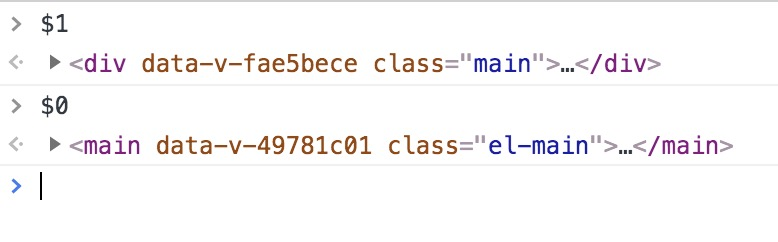

# chrome调试技巧

> 使用console,总是打印对象

在使用console.log();的时候，不仅仅打印变量，而是要打印对象，用大括号({})将变量包围起来。这样的优点是不仅会把变量的值打印，同时还会将变量名打印出来。

> 使用console.table打印对象

如果你要打印的是一个对象或数组，建议使用console.table来打印，使其呈现更加直观易读。

> 给log添加颜色

log有时候变得非常多，包含你自己的、一些第三方扩展或者浏览器的logs。除了使用过滤器(filter)以外，你还可以使用颜色来更好地区分

> 在console面板使用$和$$快捷键

在没有引入任何第三方库的情况下，可以使用$和$$在作为document.querySelector和document.querySelectorAll的快捷键。除了提供了一个更加快捷的方式外，还有一个好处，$$返回一个数组，而不是array-like的NodeList. 所以你可以直接使用map, reduce和filter 函数。

> 使用\$0和\$1

如果你想引用某个DOM元素，使用$0。$0指向你当前在Element中选中的元素。如果指定了$0，$1指向之前选中的元素。以此类推，直到$4都可以使用。

> 使用$_缓存上一步操作

$_记录了最后一次在console计算的表达式。

> copy as fetch

- 在 Network 标签页中，选中一个请求
- 右击，选择 Copy --> Copy as fetch

> 手动给元素添加一个点击事件监听

在 debug 的时候，有时候需要在元素的点击事件监听函数中，将该点击事件对象打印出来。有个更方便的方式，是可以直接在 Elements 标签页为页面元素添加事件监听事件。

操作：

在 Elements 标签页中选中一个页面元素（选中之后，默认可以通过 $0 变量获取到该元素 ）
在 Console 标签页中，调用函数 monitorEvents，输入两个参数，第一个是当前元素（$0），第二个是事件名（click）
按 Enter后，当被选中的元素触发了点击事件之后，Console 标签页会将该点击事件对象打印出来

> overrides重写

在 Chrome DevTools上调试 css 或 JavaScript时，修改的属性值在重新刷新页面时，所有的修改都会被重置。如果你想把修改的值保存下来，刷新页面的时候不会被重置，那就看看下面这个特性（Overrides）吧。Overrides默认是关闭的，需要手动开启，开启的步骤如下。

开启的操作：

- 打开 Chrome DevTools 的 Sources 标签页
- 选择 Overrides 子标签
- 选择 + Select folder for overrides，来为
- Overrides 设置一个保存重写属性的目录

> getEventListeners

getEventListeners(domElement) 返回在DOM元素上注册的所有的事件

> copy函数

copy(anything) 是一个很有用的工具函数方便你将任何东西拷贝到系统的粘贴板暂存。

给copy函数传入一个没有格式的JSON，会返回格式化的结果：

> 使用devTools做IDE

DevTools的source面板可以说相当强大。你可以快速查找，跳转到某一行，某个函数，执行一段代码，使用多行光标等等。这些功能在这篇medium文章中有详细描述。

既然如此，为啥不把整个开发都搬到这里呢。这样就不需要浪费时间切换IDE和浏览器了。

如果你有一个使用create-react-app或则vue-cli构建的项目，你可以直接把整个文件夹拖到Sources面板下。DevTools会自动对所有文件做映射。所以，你可以在DevTools下修改文件并立即查看。这样，整个开发效率，特别是Debugging效率绝对提高了。

> 截屏

在新版本的 Chrome 中，提供了一个截图的 API，你可以将整个页面截图或者截取部分页面元素，且截取的图片尺寸跟浏览器当前视图中要截取的内容所占尺寸一致。截图输出的是 png 格式的图片，会自动通过浏览器下载到默认的目录下。现在有三种截取的方式：截取整个页面、部分元素 或 当前视图。

##### 截取页面部分元素的操作：

CMD + SHIFT + P (windows 中用CTRL + SHIFT + P) 打开命令菜单
在 Elements 标签页，选中要截取的页面元素
选择 Capture node screenshot

##### 截取完整页面的操作

CMD + SHIFT + P (windows 中用CTRL + SHIFT + P) 打开命令菜单
选择 Capture full size screenshot （不需要选择页面元素）

##### 截取当前视图内的页面

CMD + SHIFT + P (windows 中用 CTRL + SHIFT + P) 打开命令菜单
选择 Capture screenshot （不需要选择页面元素）
