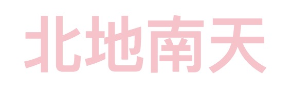
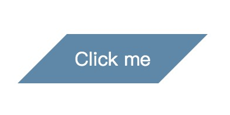
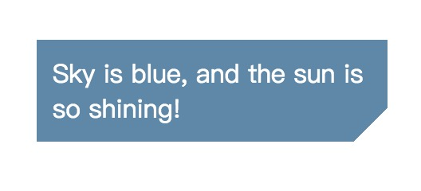

# css奇淫巧技

### 使用纯CSS实现英文句子所有首字母大写

<div class="text-capital">when you say nothing at all.</div>

```css
text-transform: capitalize;
```

### 使用纯CSS实现列表第二行到最后一行的背景颜色为红色

```css
li:not(first-child) {
  background: red;
}
```

```css
li:nth-child(n+2) {
  background: red;
}
```

### letter-spacing实现文字倒序



```html
<div class="box">
  <div class="text">天南地北</div>
</div>
```

```css
.box {
  width: 100%;
  height: auto;
  text-align: center;
}
.text {
  font-size: 60px;
  letter-spacing: -120px;
  margin: 0 auto;
  font-weight: bold;
  color: pink;
}
```

### skew实现平行四边形



```html
<div class="button">Click me</div>
```

```css
.button {
  position: relative;
  color: #fff;
  width: 100px;
  text-align: center;
  padding: 10px;
  margin-left: 100px;
  margin-top: 100px;
}

.button::before {
  content: '';
  position: absolute;
  left: 0;
  right: 0;
  top: 0;
  bottom: 0;
  z-index: -1;
  background: #58a;
  transform: skew(-45deg);
}
```

### linear-gradient实现切角效果



```html
<div class="box">
  Sky is blue, and the sun is so shining!
</div>
```

```css
.box {
  background: #58a;
  color: #fff;
  width: 200px;
  padding: 10px;
  background: linear-gradient(-45deg, transparent 15px, #58a 0);
}
```

### 空心字效果

<div class="hollow">CSS</div>

```html
<div class="hollow">CSS</div>
```

```css
.text-capital {
  text-transform: capitalize;
}
.hollow {
  width: 300px;
  height: 100px;
  line-height: 1.4;
  font-size: 70px;
  text-align: center;
  background: deeppink;
  color: white;
  text-shadow: 1px 1px black, -1px -1px black,
    1px -1px black, -1px 1px black;
}
```

<style>
.hollow {
  width: 300px;
  height: 100px;
  line-height: 1.4;
  font-size: 70px;
  text-align: center;
  background: deeppink;
  color: white;
  text-shadow: 1px 1px black, -1px -1px black,
    1px -1px black, -1px 1px black;
}
</style>
