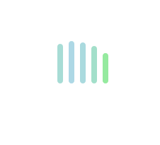
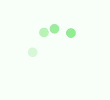

# css实现loading样式

### 前言

loading作为用户体验中，不可或缺的一环，是前端开发中总能遇到的。一个好看的loading能够让用户在等待的过程中，心情美好，因此，学会实现loading，也是每一个前端工程师的必备技能。

### 效果一



```html
<div class="loading">
  <span></span>
  <span></span>
  <span></span>
  <span></span>
  <span></span>
</div>
```

```css
.loading {
  width: 80px;
  height: 40px;
  margin: 0 auto;
  margin-top: 100px;
}
.loading span {
  display: inline-block;
  width: 8px;
  height: 100%;
  border-radius: 4px;
  background: lightgreen;
  -webkit-animation: load 1.04s ease infinite;
  animation: load 1.04s ease infinite;
}

@-webkit-keyframes load {
  0%, 100% {
      height: 40px;
      background: lightgreen;
  }
  50% {
      height: 60px;
      margin-top: -20px;
      background: lightblue;
  }
}

@keyframes load {
  0%, 100% {
      height: 40px;
      background: lightgreen;
  }
  50% {
      height: 60px;
      margin-top: -20px;
      background: lightblue;
  }
}

.loading span:nth-child(2) {
  -webkit-animation-delay: 0.13s;
  animation-delay: 0.13s;
}
.loading span:nth-child(3) {
  -webkit-animation-delay: 0.26s;
  animation-delay: 0.26s;
}
.loading span:nth-child(4) {
  -webkit-animation-delay: 0.39s;
  animation-delay: 0.39s;
}
.loading span:nth-child(5) {
  -webkit-animation-delay: 0.52s;
  animation-delay: 0.52s;
}
```

### 效果二



```html
<div class="loadEffect">
    <div><span></span></div>
    <div><span></span></div>
    <div><span></span></div>
    <div><span></span></div>
</div>
```

```css
.loadEffect {
    width: 100px;
    height: 100px;
    margin: 0 auto;
    margin-top: 100px;
    position: relative;
}
.loadEffect div {
    width: 100%;
    height: 100%;
    position: absolute;
    -webkit-animation: load 2.08s linear infinite;
    animation: load 2.08s linear infinite;
}
.loadEffect div span {
    display: inline-block;
    width: 20px;
    height: 20px;
    border-radius: 50%;
    background: lightgreen;
    position: absolute;
    left: 50%;
    margin-top: -10px;
    margin-left: -10px;
}
@-webkit-keyframes load {
    0% {
        -webkit-transform: rotate(0deg);
        transform: rotate(0deg);
    }
    10% {
        -webkit-transform: rotate(45deg);
        transform: rotate(45deg);
    }
    50% {
        opacity: 1;
        -webkit-transform: rotate(160deg);
        transform: rotate(160deg);
    }
    62% {
        opacity: 0;
    }
    65% {
        opacity: 0;
        -webkit-transform: rotate(200deg);
        transform: rotate(200deg);
    }
    90% {
        -webkit-transform: rotate(340deg);
        transform: rotate(340deg);
    }
    100% {
        -webkit-transform: rotate(360deg);
        transform: rotate(360deg);
    }
}
.loadEffect div:nth-child(1) {
    -webkit-animation-delay: 0.2s;
    animation-delay: 0.2s;
}
.loadEffect div:nth-child(2) {
    -webkit-animation-delay: 0.4s;
    animation-delay: 0.4s;
}
.loadEffect div:nth-child(3) {
    -webkit-animation-delay: 0.6s;
    animation-delay: 0.6s;
}
.loadEffect div:nth-child(4) {
    -webkit-animation-delay: 0.8s;
    animation-delay: 0.8s;
}
```

### 效果三

<div class="box">
  <div class="loader-01"></div>
</div>

```html
<div class="box">
  <div class="loader-01"></div>
</div>
```

```css
.box {
  border-radius: 3px;
  border-width: 3px;
  font-size: 30px;
  color: #d60b52;
  padding: 1em;
}

[class*="loader-"] {
  width: 1em;
  height: 1em;
  color: #d60b52;
  pointer-events: none;
  font-size: 70px;
  line-height: 200px;
}

.loader-01 {
  border: .2em dotted currentcolor;
  border-radius: 50%;
  -webkit-animation: 1s loader-01 linear infinite;
  animation: 1s loader-01 linear infinite;
}
@-webkit-keyframes loader-01 {
  0% {
    -webkit-transform: rotate(0deg);
    transform: rotate(0deg);
  }
  100% {
    -webkit-transform: rotate(360deg);
    transform: rotate(360deg);
  }
}
@keyframes loader-01 {
  0% {
    -webkit-transform: rotate(0deg);
    transform: rotate(0deg);
  }
  100% {
    -webkit-transform: rotate(360deg);
    transform: rotate(360deg);
  }
}
```

### 效果四

```html
<div class="box">
  <div class="loader-05"></div>
</div>
```

```css
.box {
  border-radius: 3px;
  font-size: 30px;
  color: #d60b52;
  width: 200px;
  height: 200px;
  line-height: 200px;
}

.loader-05 {
  border: .2em solid transparent;
  border-top-color: currentcolor;
  border-radius: 50%;
  -webkit-animation: 1s loader-05 linear infinite;
  animation: 1s loader-05 linear infinite;
  position: relative;
}
.loader-05:before {
  content: '';
  display: block;
  width: inherit;
  height: inherit;
  position: absolute;
  top: -.2em;
  left: -.2em;
  border: .2em solid currentcolor;
  border-radius: 50%;
  opacity: .5;
}
@-webkit-keyframes loader-05 {
  0% {
    -webkit-transform: rotate(0deg);
    transform: rotate(0deg);
  }
  100% {
    -webkit-transform: rotate(360deg);
    transform: rotate(360deg);
  }
}
@keyframes loader-05 {
  0% {
    -webkit-transform: rotate(0deg);
    transform: rotate(0deg);
  }
  100% {
    -webkit-transform: rotate(360deg);
    transform: rotate(360deg);
  }
}
```

<style>
.box {
  border-radius: 3px;
  border-width: 3px;
  font-size: 30px;
  color: #d60b52;
  padding: 1em;
}

[class*="loader-"] {
  display: inline-block;
  width: 1em;
  height: 1em;
  color: #d60b52;
  pointer-events: none;
  font-size: 70px;
  line-height: 200px;
}

.loader-01 {
  border: .2em dotted currentcolor;
  border-radius: 50%;
  -webkit-animation: 1s loader-01 linear infinite;
  animation: 1s loader-01 linear infinite;
}
@-webkit-keyframes loader-01 {
  0% {
    -webkit-transform: rotate(0deg);
    transform: rotate(0deg);
  }
  100% {
    -webkit-transform: rotate(360deg);
    transform: rotate(360deg);
  }
}
@keyframes loader-01 {
  0% {
    -webkit-transform: rotate(0deg);
    transform: rotate(0deg);
  }
  100% {
    -webkit-transform: rotate(360deg);
    transform: rotate(360deg);
  }
}
</style>
