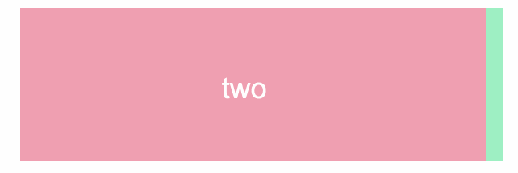
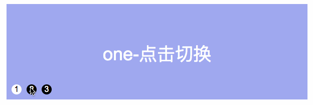

# css实现轮播图

轮播在各个公司的官网上是非常常见的一种功能，能够有效的展示多个动态信息。之前一般实现轮播，是使用的js的动画。今天来介绍一种使用纯css实现的轮播图。




```html
<div class="slide">
  <ul class="slide-auto">
    <li>one</li>
    <li>two</li>
    <li>three</li>
  </ul>
</div>
```

```css
.slide {
    position: relative;
    margin: auto;
    width: 600px;
    height: 200px;
    text-align: center;
    font-family: Arial;
    color: #FFF;
    overflow: hidden;
}

.slide ul {
    margin: 10px 0;
    padding: 0;
    width: 9999px;
    transition: all 0.5s;
}

/*//自动播放*/
.slide .slide-auto {
    animation: marginLeft 10.5s infinite;
}

.slide li {
    float: left;
    width: 600px;
    height: 200px;
    list-style: none;
    line-height: 200px;
    font-size: 36px;
}

.slide li:nth-child(1) {
    background: #9fa8ef;
}

.slide li:nth-child(2) {
    background: #ef9fb1;
}

.slide li:nth-child(3) {
    background: #9fefc3;
}

@keyframes marginLeft {
    0% {
        margin-left: 0;
    }

    28.5% {
        margin-left: 0;
    }

    33.3% {
        margin-left: -600px;
    }

    62% {
        margin-left: -600px;
    }

    66.7% {
        margin-left: -1200px;
    }

    95.2% {
        margin-left: -1200px;
    }

    100% {
        margin-left: 0;
    }
}
```




```html
<!-- 点击轮播 -->
<div class="slide" style="margin-top: 80px;">

  <input type="radio" name="sildeInput" value="0" id="sildeInput1" checked hidden />
  <label for="sildeInput1">1</label>

  <input type="radio" name="sildeInput" value="1" id="sildeInput2" hidden />
  <label for="sildeInput2">2</label>

  <input type="radio" name="sildeInput" value="1" id="sildeInput3" hidden />
  <label for="sildeInput3">3</label>


  <ul>
    <li>one-点击切换</li>
    <li>two-点击切换</li>
    <li>three-点击切换</li>
  </ul>
</div>
```

```css
.slide {
  position: relative;
  margin: auto;
  width: 600px;
  height: 200px;
  text-align: center;
  font-family: Arial;
  color: #FFF;
  overflow: hidden;
}

.slide ul {
  margin: 10px 0;
  padding: 0;
  width: calc(600px * 3);
  transition: all 0.5s;
}

.slide li {
  float: left;
  width: 600px;
  height: 200px;
  list-style: none;
  line-height: 200px;
  font-size: 36px;
}

.slide li:nth-child(1) {
  background: #9fa8ef;
}

.slide li:nth-child(2) {
  background: #ef9fb1;
}

.slide li:nth-child(3) {
  background: #9fefc3;
}

.slide input[name="sildeInput"] {
  display: none;
}

.slide label[for^="sildeInput"] {
  position: absolute;
  top: 170px;
  width: 20px;
  height: 20px;
  margin: 0 10px;
  line-height: 20px;
  color: #FFF;
  background: green;
  cursor: pointer;
  border-radius: 50%;
}

.slide label[for="sildeInput1"] {
  left: 0;
}

.slide label[for="sildeInput2"] {
  left: 30px;
}

.slide label[for="sildeInput3"] {
  left: 60px;
}

#sildeInput1:checked~ul {
  margin-left: 0;
}

#sildeInput2:checked~ul {
  margin-left: -600px;
}

#sildeInput3:checked~ul {
  margin-left: -1200px;
}

#sildeInput1:checked~label[for="sildeInput1"] {
    color: #000;
    background: #fff;
}

#sildeInput2:checked~label[for="sildeInput2"] {
    color: #000;
    background: #fff;
}

#sildeInput3:checked~label[for="sildeInput3"] {
    color: #000;
    background: #fff;
}
```
