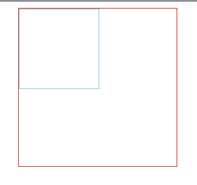
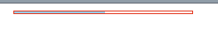
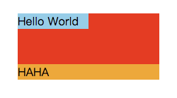
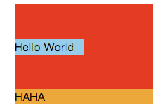
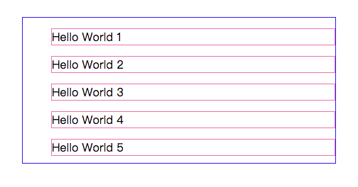
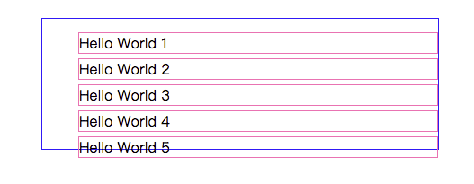

# css的垂直格式化

块级元素垂直格式化的7大属性：
- margin-top
- border-top
- padding-top
- width
- padding-bottom
- border-bottom
- margin-bottom

这7个属性只有3个属性可以设置为auto,即height,margin-top,margin-bottom。
padding和border都必须设置为特定的值，或者默认为0（如果没有设置border-style）。如果设置了border-style，边框的宽度会设置为值medium（这个值的定义并不明确）。

如果块元素的margin-top和margin-bottom设置为auto，它会自动计算为0。
height必须设置为auto或者非负值。

#### 百分数高度
```html
<div class="outer">
  <div class="inner"></div>
</div>
```
```css
.outer {
  width: 200px;
  height: 200px;
  border: 1px solid red;
  margin: 0 auto;
}

.inner {
  width: 50%;
  height: 50%;
  border: 1px solid skyblue;
}
```


**垂直居中的一种方式是设置margin-top和margin-bottom为(parentHeight-height)/2。**

如果没有显式声明包含块的height，百分数高度会重置为auto。

```css
.outer {
  width: 200px;
  border: 1px solid red;
  margin: 0 auto;
}

.inner {
  width: 50%;
  height: 50%;
  border: 1px solid skyblue;
}
```


如果包含块的高度为auto，其默认高度是最高块级子元素的外边框边界到款最低块级子元素外边框边界之间的距离。**因此子元素的外边距会超出包含子元素的块元素。**

#### auto高度
```html
<div class="outer">
  <div class="inner">Hello World</div>
  <div class="inner1">HAHA</div>
</div>
```
```css
.outer {
  width: 200px;
  height: auto;
  background: red;
  margin: 0 auto;
}

.inner {
  width: 50%;
  height: 50%;
  margin-top: 25%;
  margin-bottom: 25%;
  background: skyblue;
}

.inner1 {
  background: orange;
  margin-bottom: -15px;
}
```



不过如果给父级块元素添加上border-top或者padding-top,则其高度为其最高子元素的上外边距边界到其最低子元素的下外边距边界之间的距离。
```css
.outer {
  width: 200px;
  height: auto;
  background: red;
  margin: 0 auto;
  padding-top: 1px; /*或者添加border-top: 1px solid;*/
}

.inner {
  width: 50%;
  height: 50%;
  margin-top: 25%;
  margin-bottom: 25%;
  background: skyblue;
}

.inner1 {
  background: orange;
  margin-bottom: -15px;
}
```


#### 合并垂直外边距
下面来看个例子：
```html
<ul class="list">
  <li class="cell"></li>
  <li class="cell"></li>
  <li class="cell"></li>
  <li class="cell"></li>
  <li class="cell"></li>
</ul>
```
```css
.list {
  list-style: none;
  border: 1px solid blue;
  counter-reset: li;
  width: 400px;
  margin: 0 auto;
  margin-top: 80px;
}

.cell {
  border: 1px solid hotpink;
  margin-top: 15px;
  margin-bottom: 10px;
}

.cell::after {
  counter-increment: li;
  content: "Hello World "counter(li);
}
```


这边设置了margin-top为15px，margin-bottom为10px，但是li之间的距离为15px，实际上是margin-top和margin-bottom合并了。

#### 负外边距
如果垂直外边距都设置为负值，浏览器会取两个外边距绝对值的最大值。
如果一个为正值，一个为负值，则从正外边距减去负外边距的绝对值。
```css
.list {
  list-style: none;
  border: 1px solid blue;
  counter-reset: li;
  width: 400px;
  margin: 0 auto;
  margin-top: 80px;
}

.cell {
  border: 1px solid hotpink;
  margin-top: 15px;
  margin-bottom: -10px;
}

.cell::after {
  counter-increment: li;
  content: "Hello World "counter(li);
}
```



