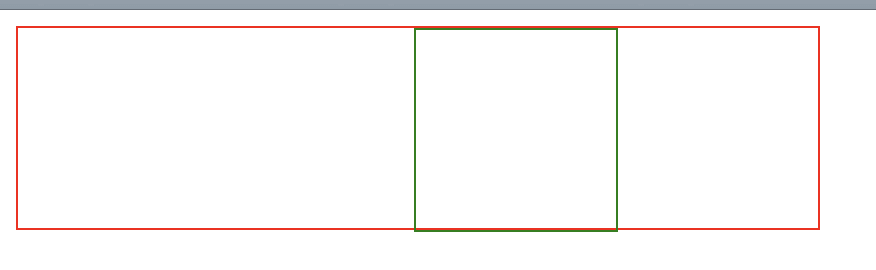
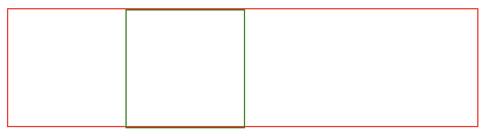
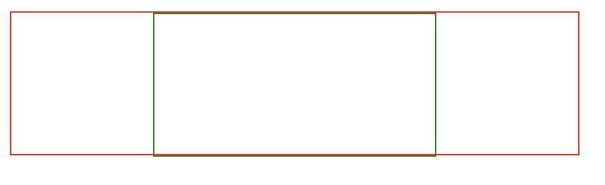
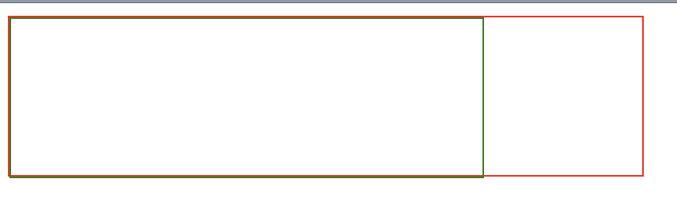
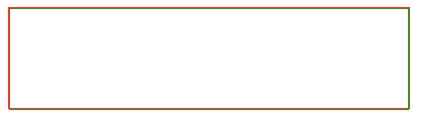
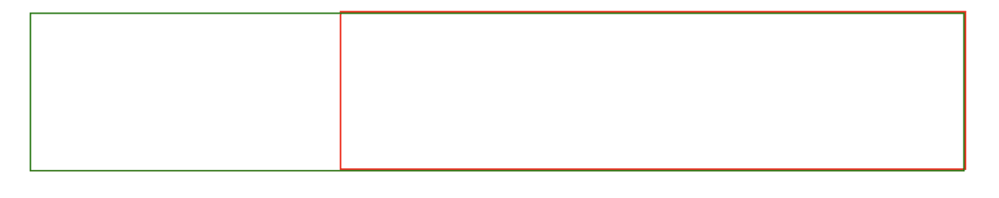

# css的水平格式化

块级元素水平格式化的7大属性：
- margin-left
- border-left
- padding-left
- width
- padding-right
- border-right
- margin-right

在这些元素中只有3个属性可以设置为auto,分别为width,margin-left和margin-right,其余属性必须设置为特定的值，或者默认宽度为0。

width必须设置为auto或者某种类型的非负值。如果在水平格式化中确实使用了auto，会得到不同的效果。

#### 使用auto

如果设置width、margin-left或margin-right中的某个值为auto，而余下的两个属性指定为特定的值，那么设置为auto的属性会确定所需的长度。
假设7个属性的和必须等于400px，没有设置内边距或边框，而且margin-right和width设置为100px，margin-left设置为auto。那么margin-left的宽度将是200px。
```html
<div class="outer">
  <div class="inner"></div>
</div>
```

```css
.outer {
  width: 400px;
  height: 100px;
  border: 1px solid red;
}

.inner {
  width: 100px;
  height: 100px;
  margin-left: auto; /*margin-left为200px*/
  margin-right: 100px;
  border: 1px solid green;
}
```


从某种程度上讲，可以用auto弥补实际值与所需总和的差距。不过，如果这3个属性都设置为100px，即没有任何一个属性设置为auto会怎么样呢？

如果所有这个3个属性都设置为非auto的某个值，**按CSS的术语来讲，这些格式化属性过分受限，此时，总会把margin-right强制为auto。**
用户代理把margin-right重置为auto，margin-right会根据有一个auto值时的规矩来设置，即由这个auto值填补所需的距离，使元素的总宽度等于其包含块的width。
```css
.outer {
  width: 400px;
  height: 100px;
  border: 1px solid red;
}

.inner {
  width: 100px;
  height: 100px;
  margin-left: 100px; 
  margin-right: 100px;/*margin-right为200px*/
  border: 1px solid green;
}
```


如果两个外边距都显示地设置，而width为auto，width就会是所需的值，从而达到需要的父元素宽度。

```css
.outer {
  width: 400px;
  height: 100px;
  border: 1px solid red;
}

.inner {
  width: auto;/*width为200px*/
  height: 100px;
  margin-left: 100px; 
  margin-right: 100px;
  border: 1px solid green;
}
```



#### 多个auto
如果将width,margin-left和margin-right中的两个设置为auto会出现什么情况呢。

假设设置margin-left和margin-right为auto：
```css
.outer {
  width: 400px;
  height: 100px;
  border: 1px solid red;
}

.inner {
  width: 100px;
  height: 100px;
  margin-left: auto; 
  margin-right: auto;
  border: 1px solid green;
}
```
margin-left和margin-right会等于(400-100)/2,即150px，这种方法可以达到居中块级元素的效果（text-align：center只能应用于块级元素的内联内容）

**假设设置margin-left和width为auto：**
```css
.outer {
  width: 400px;
  height: 100px;
  border: 1px solid red;
}

.inner {
  width: auto;
  height: 100px;
  margin-left: auto;
  margin-right: 100px;
  border: 1px solid green;
}
```


margin-left会重置为0，width会填充剩余的宽度。

**假设三个值都auto，那么外边距为0，width尽量宽。**
```css
.outer {
  width: 400px;
  height: 100px;
  border: 1px solid red;
}

.inner {
  width: auto;
  height: 100px;
  margin-left: auto;
  margin-right: auto;
  border: 1px solid green;
}
```


#### 负外边距
假设width,margin-right为auto，margin-left为-200px
```css
.outer {
  width: 400px;
  height: 100px;
  border: 1px solid red;
  margin: 0 auto;
}

.inner {
  width: auto;
  height: 100px;
  margin-left: -200px;
  margin-right: auto;
  border: 1px solid green;
}
```


width为600px,这里width大于400px，是因为7个元素总和必须为400px，所以出现了width大于400px的现象。

**另外边框的border的宽度不能为百分数，只能是长度

#### 替换元素
替换元素的width设置为auto时，和非替换元素有区别。
替换元素的width为替换元素的默认宽度。
