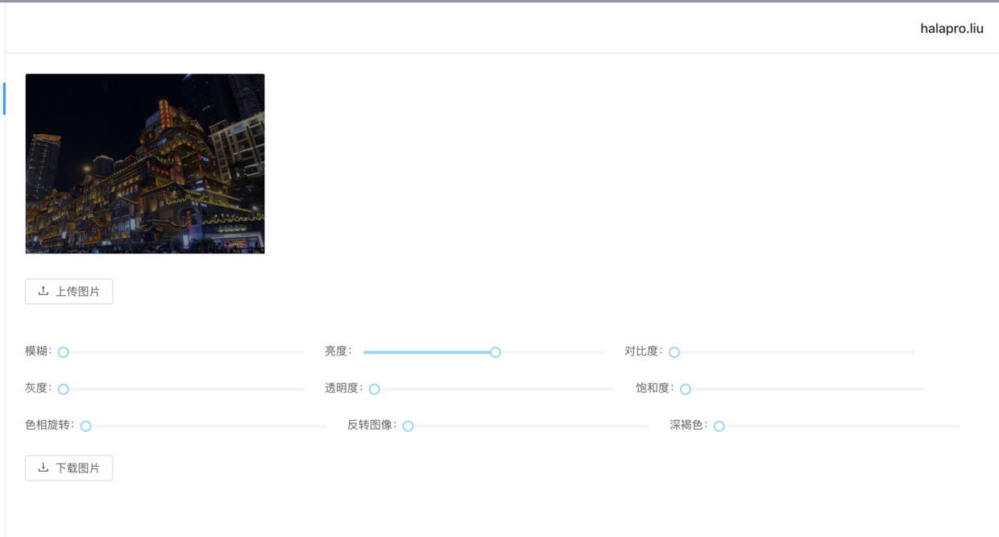

# 使用CSS:filter实现类PS操作

### filter: blur（高斯模糊）

```css
-webkit: blur(10px);
filter: blur(10px);
```


### filter: brightness（亮度）

```css
-webkit-filter: brightness(55%);
filter: brightness(55%);
```

### filter: contrast（对比度）

```css
-webkit-filter: contrast(30%);
filter: contrast(30%);
```

### filter: grayScale（灰度）

```css
-webkit-filter: grayScale(30%);
filter: grayScale(30%);
```

### filter: invert（反转图像）

```css
-webkit-filter: invert(30%);
filter: invert(30%);
```

### filter: saturate（饱和度）

```css
-webkit-filter: saturate(30%);
filter: saturate(30%);
```

### filter: hue-rotate（色相旋转）

```css
-webkit-filter: hue-rotate(90deg);
filter: hue-rotate(90deg);
```

### filter: sepia（深褐色）

```css
-webkit-filter: sepia(90deg);
filter: sepia(90deg);
```

### filter: opacity（透明度）

```css
-webkit-filter: opacity(25%);
filter: opacity(25%);
```

### 同时支持连写
```css
-webkit-filter: brightness(75%) saturate(30%);
filter: brightness(75%) saturate(30%);
```

具体实例可以使用pc点击查看我的[react-antd-redux](https://github.com/halaproliu/react-antd-redux)

或者直接查看[github pages](https://halaproliu.github.io/react-antd-redux/#/imageProcess)



