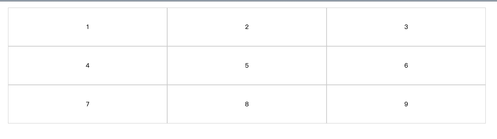

# css实现一行三个元素

要实现一行三个元素，可以借用flex的flex-basis和flex-wrap属性来完成

### flex-basis

flex-basis 属性用于设置或检索弹性盒伸缩基准值。。

***注意：***如果元素不是弹性盒对象的元素，则 flex-basis 属性不起作用。

### 实现源码

```html
<ul class="box">
    <li class="item">1</li>
    <li class="item">2</li>
    <li class="item">3</li>
    <li class="item">4</li>
    <li class="item">5</li>
    <li class="item">6</li>
    <li class="item">7</li>
    <li class="item">8</li>
    <li class="item">9</li>
</ul>
```

```css
.box {
    display: flex;
    flex-wrap: wrap;
}

.item {
    list-style: none;
    border: 1px solid #ccc;
    height: 100px;
    line-height: 100px;
    text-align: center;
    flex-basis: 30%;
}
```

### 效果图


