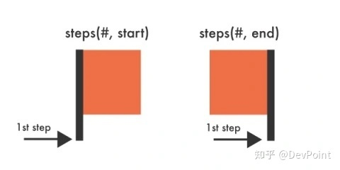

# 纯CSS实现随机翻牌效果之steps 妙用

翻牌是大家很熟悉的一个互动效果，通常在抽奖活动中出现。那么不借助 JavaScript 是否能够实现随机翻牌效果？翻牌效果肯定是没有问题，CSS 没有随机函数，今天就来分享一个另类的交互实现思路。

> CSS 没有内置的“随机”函数，没有像 Javascript 中的 Math.random() 函数，也根本无法生成随机数或随机颜色。

基于上面的问题，需要转换思路，让元素通过复杂的动画实现出随机的效果。实现的原理让纸牌快速地呈现出不同的状态，让这些纸牌在1秒内循环通过所有54个状态，用户点击每张纸牌就暂停动画，并让纸牌翻转。

> 在线预览

> 此方案不足的地方就是无法避免三张牌出现相同的花色和牌面

### 概括

使用动画使元素看起来随机行为的这个思路是不很有趣，有点出乎意料，大部分用户看到这个效果肯定意识不到时纯 CSS 实现的。

现在 CSS 远不止我们现在看到的，它能够带来什么取决于创造性，我一直坚信没有实现不了的交互，只有想不到的交互。

### 要点

效果主要用到 CSS 中的动画属性 animation，自定义一个动画过程 randomAnim ，点击通过经典的 input checkbox + label 组合，动画控制器 animation-play-state: paused 和 animation-play-state: running;，下面是关键的steps()。

steps()是一个阶跃函数（timing-function），允许将动画或者过渡效果分割成段，而不是从一种状态持续到另一种状态的过渡。这个函数有两个参数：

第一个参数是一个正值，指定我希望动画分割的段数。
第二个参数是可选的，可设值：start 和 end，表示在每个间隔的起点或是终点发生阶跃变化，默认是 end。例如 steps(1,start)，动画分成1步，动画执行时为左侧端点的部分为开始；steps(1,end)，动画分成1步，动画执行时为右侧结尾端点的部分为开始。

> 阶跃函数（timing-function）是用于每两个关键帧之间，而不是整个动画。