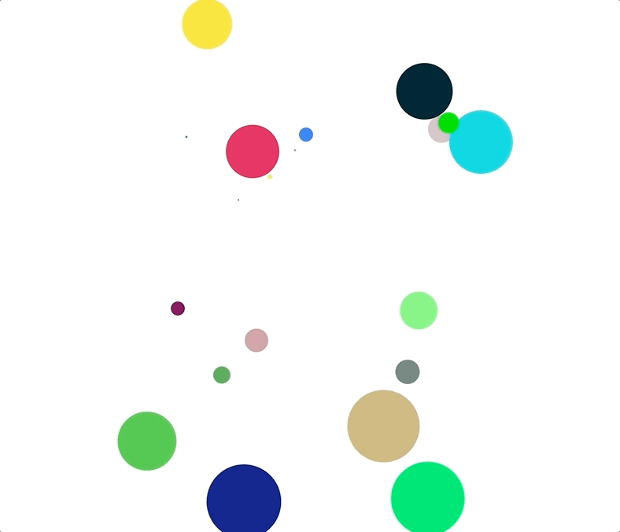

# 使用random实现随机动画

使用随机颜色，随机位置，实现动画

### 生成随机数方案

> 传统方式

使用随机数方式

```js
function randomColor() {
  let r = Math.floor(Math.random() * 200)
  let g = Math.floor(Math.random() * 200)
  let b = Math.floor(Math.random() * 200)
  return `rgb(${r}, ${g}, ${b})`
}
```

> 特殊方式

使用random结合toString方法的16进制方式，生成16进制数

```js
function randomColor() {
  return `#${Math.random().toString(16).slice(2, 8)}`
}
```

### 具体实现

```html
<div id="app"></div>
```

```css
#app {
  width: 400px;
  height: 400px;
  position: relative;
  margin: 0 auto;
}
.circle {
  border-radius: 100%;
  position: absolute;
}
```

```js
let dom = ''
let currStyle = document.styleSheets[0]
let token = window.WebKitCSSKeyframesRule ? '-webkit-' : ''
let baseMove = 600
for (let i = 0; i < 20; i++) {
  let randomWH = Math.floor(Math.random() * 100)
  let top = Math.floor(Math.random() * baseMove)
  let left = Math.floor(Math.random() * baseMove)
  let moveTop = Math.floor(Math.random() * baseMove)
  let moveLeft = Math.floor(Math.random() * baseMove)
  currStyle.insertRule(`@${token}keyframes moveX${i} { 0% { left: ${left}px;} 100% { left: ${moveLeft}px; } }`);
  currStyle.insertRule(`@${token}keyframes moveY${i} { 0% { top: ${top}px;} 100% { top: ${moveTop}px; } }`);
  let style = `background-color: ${randomColor()};`
  style += `width: ${randomWH}px; height: ${randomWH}px;`
  style += `left: ${left * i}px; top: ${top * i}px;`
  style += `animation: moveX${i} 4s cubic-bezier(0.36,0,0.64,1) -2s infinite alternate, moveY${i} 4s cubic-bezier(0.36,0,0.64,1) 0s infinite alternate;`
  dom += `<div class="circle" style="${style}"></div>`
}
document.getElementById('app').innerHTML = dom
```

### 最终效果

