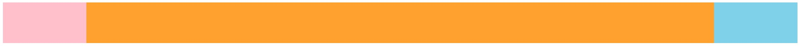

# css实现三栏布局的多种方式

### 前言

在PC端系统中，三栏布局是很常见的。那么有哪些方式来实现三栏布局呢。

### flex布局

```html
<div class="box">
    <div class="left"></div>
    <div class="center"></div>
    <div class="right"></div>
</div>
```

```css
.box {
  width: 100%;
  height: 100px;
  line-height: 100px;
  text-align: center;
  display: flex;
}

.left {
  width: 200px;
  background-color: pink;
}

.center {
  flex: 1;
  background-color: orange;
}

.right {
  width: 200px;
  background-color: skyblue;
}
```



### float布局

这里有个主意点，right的div必须在center前，不然右边会塌陷。

```html
<div class="box">
    <div class="left"></div>
    <div class="right"></div>
    <div class="center"></div>
</div>
```

```css
.box {
  width: 100%;
  height: 100px;
  line-height: 100px;
  text-align: center;
}

.left {
  float: left;
  background: red;
}

.center {
  background: orange;
}

.right {
  float: right;
  background: skyblue;
}
```

同时要注意div的特点

- 空的div是没有高度的。
- div的高度由其内容决定
- 如果没有指定float属性，div的宽度等于其父元素的宽度（不管是否有内容）
- 如果指定了float属性，div的宽度取决于内部圆度的宽度（空的div指定了float属性后既没有宽度也没有高度）


### postion布局

```html
<div class="box">
    <div class="left"></div>
    <div class="right"></div>
    <div class="center"></div>
</div>
```

```css
.box {
  width: 100%;
  height: 100px;
  line-height: 100px;
  text-align: center;
  position: relative;
}

.left {
  position: absolute;
  left: 0;
  width: 200px;
  background-color: pink;
}

.center {
  background-color: orange;
}

.right {
  position: absolute;
  right: 0;
  width: 200px;
  background-color: skyblue;
}
```

### table布局

```html
<div class="box">
    <div class="left"></div>
    <div class="center"></div>
    <div class="right"></div>
</div>
```

```css
.box {
  width: 100%;
  height: 100px;
  line-height: 100px;
  text-align: center;
  display: table;
}

.left {
  display: table-cell;
  background: pink;
  width: 400px;
  height: 100%;
}

.center {
  display: table-cell;
  background: orange;
  height: 100%;
}

.right {
  display: table-cell;
  background: skyblue;
  width: 400px;
  height: 100%;
}
```

### 网格布局

```html
<div class="box">
    <div class="left"></div>
    <div class="center"></div>
    <div class="right"></div>
</div>
```

```css
.box {
  width: 100%;
  height: 100px;
  line-height: 100px;
  text-align: center;
  display: grid;
  grid-template-columns: 200px auto 200px;
}

.left {
  background: pink;
}

.center {
  background: orange;
}

.right {
  background: skyblue;
}
```
