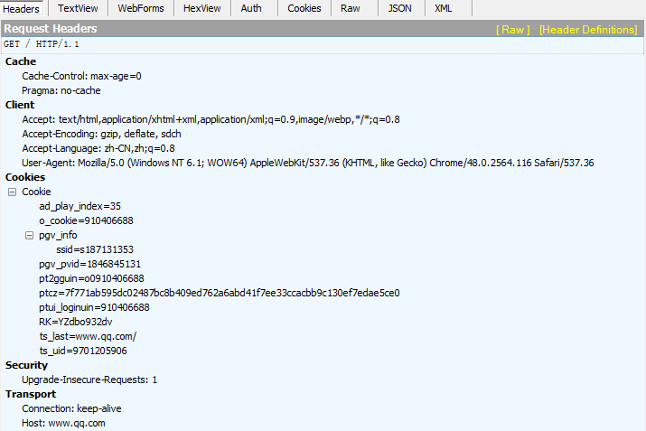

# http2特性

### 前言

HTTP/2 是 HTTP 协议自 1999 年 HTTP 1.1 发布后的首个更新，主要基于 SPDY 协议。由互联网工程任务组（IETF）的 Hypertext Transfer Protocol Bis（httpbis）工作小组进行开发。该组织于2014年12月将HTTP/2标准提议递交至IESG进行讨论，于2015年2月17日被批准。HTTP/2标准于2015年5月以RFC 7540正式发表。

那 HTTP/2 到底有哪些具体变化呢？

### 二进制分帧

先来理解几个概念：

帧：HTTP/2 数据通信的最小单位消息：指 HTTP/2 中逻辑上的 HTTP 消息。例如请求和响应等，消息由一个或多个帧组成。

流：存在于连接中的一个虚拟通道。流可以承载双向消息，每个流都有一个唯一的整数ID。

HTTP/2 采用二进制格式传输数据，而非 HTTP 1.x 的文本格式，二进制协议解析起来更高效。 HTTP / 1 的请求和响应报文，都是由起始行，首部和实体正文（可选）组成，各部分之间以文本换行符分隔。HTTP/2 将请求和响应数据分割为更小的帧，并且它们采用二进制编码。

HTTP/2 中，同域名下所有通信都在单个连接上完成，该连接可以承载任意数量的双向数据流。每个数据流都以消息的形式发送，而消息又由一个或多个帧组成。多个帧之间可以乱序发送，根据帧首部的流标识可以重新组装。

### 多路复用

多路复用，代替原来的序列和阻塞机制。所有就是请求的都是通过一个 TCP连接并发完成。 HTTP 1.x 中，如果想并发多个请求，必须使用多个 TCP 链接，且浏览器为了控制资源，还会对单个域名有 6-8个的TCP链接请求限制，如下图，红色圈出来的请求就因域名链接数已超过限制，而被挂起等待了一段时间：

在 HTTP/2 中，有了二进制分帧之后，HTTP /2 不再依赖 TCP 链接去实现多流并行了，在 HTTP/2中：

- 同域名下所有通信都在单个连接上完成。
-单个连接可以承载任意数量的双向数据流。
- 数据流以消息的形式发送，而消息又由一个或多个帧组成，多个帧之间可以乱序发送，因为根据帧首部的流标识可以重新组装。
这一特性，使性能有了极大提升：

- 同个域名只需要占用一个 TCP 连接，消除了因多个 TCP 连接而带来的延时和内存消耗。
- 单个连接上可以并行交错的请求和响应，之间互不干扰。
- 在HTTP/2中，每个请求都可以带一个31bit的优先值，0表示最高优先级， 数值越大优先级越低。有了这个优先值，客户端和服务器就可以在处理不同的流时采取不同的策略，以最优的方式发送流、消息和帧。


### 服务器推送

服务端可以在发送页面HTML时主动推送其它资源，而不用等到浏览器解析到相应位置，发起请求再响应。例如服务端可以主动把JS和CSS文件推送给客户端，而不需要客户端解析HTML时再发送这些请求。

服务端可以主动推送，客户端也有权利选择是否接收。如果服务端推送的资源已经被浏览器缓存过，浏览器可以通过发送RST_STREAM帧来拒收。主动推送也遵守同源策略，服务器不会随便推送第三方资源给客户端。

[了解更多 Server Push 特性](https://www.upyun.com/tech/article/294/1.html?utm_source=zhihu&utm_medium=referral&utm_campaign=26559480&utm_term=http2)

### 头部压缩

HTTP 1.1请求的大小变得越来越大，有时甚至会大于TCP窗口的初始大小，因为它们需要等待带着ACK的响应回来以后才能继续被发送。HTTP/2对消息头采用```HPACK（专为http/2头部设计的压缩格式）```进行压缩传输，能够节省消息头占用的网络的流量。而HTTP/1.x每次请求，都会携带大量冗余头信息，浪费了很多带宽资源。

HTTP每一次通信都会携带一组头部，用于描述这次通信的的资源、浏览器属性、cookie等，例如



为了减少这块的资源消耗并提升性能， ```HTTP/2对这些首部采取了压缩策略：```

- HTTP/2在客户端和服务器端使用“首部表”来跟踪和存储之前发送的键－值对，对于相同的数据，不再通过每次请求和响应发送；
- 首部表在HTTP/2的连接存续期内始终存在，由客户端和服务器共同渐进地更新;
- 每个新的首部键－值对要么被追加到当前表的末尾，要么替换表中之前的值。
