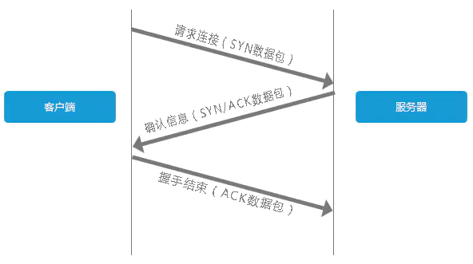
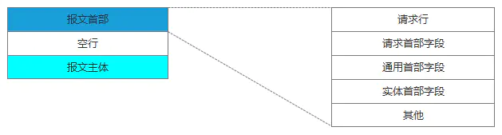
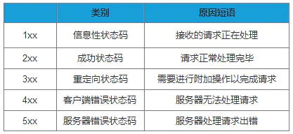
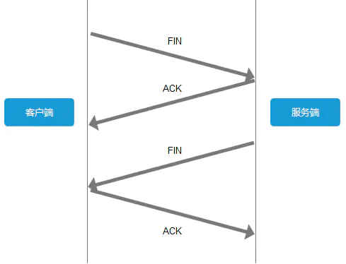

# 从url输入地址到解析经历了什么

### 前言

当我们在浏览器输入网址并回车后，都调用了哪些服务，经历了哪些步骤

### URL解析

一个URL包括协议，网络地址，资源路径
协议：最常用的比如HTTP（超文本传输协议）HTTPS（超文本传输安全协议）FTP（文件传输协议）
网络地址：可以是域名或者ip地址，包括端口号，如果没有默认为80
如果是不合法的地址，会转给默认的搜索引擎,例如如果你正在使用chrome，可以在url输入框输入你想要搜索的内容，然后搜索引擎会根据关键字进行搜索。

### DNS域名解析

- 先到缓存信息中查找
    - 系统缓存-----如果浏览器中没有找到，浏览器会有一个系统调用，获得系统缓存中的记录
    - 路由器缓存-----接着将请求发给路由器，路由器一般也有自己的DNS缓存
- DNS服务器查找
    没有则发送请求到本地域名服务器每一个本地域名服务器都维护一个高速缓存，存放最近用过的域名及其IP地址.如果还没有则发出递归查询（本地服务器请求比他高一级的服务器，如此递归直到根域名服务器，肯定能找到这个服务器的IP地址）通过这个IP可以找到客户端到服务器端的唯一路径.
- 浏览器主机根据ip地址与服务器建立TCP连接
    客户端发出建立连接的请求。数据包携带有SYN。

    如果服务端有开放的端口，可以接受并建立连接，那么服务端会返回SYN + ACK,告诉客户端我可以接受你的请求。

    客户端收到服务端的回应，发送ACK给服务端。 连接建立。

    

### 发送HTTP请求

与服务器建立了连接后，就可以向服务器发起请求了

根据HTTP协议的要求，组织一个HTTP数据包，向服务器发送HTTP请求，HTTP的请求报头有请求行和请求报头，空行。

请求行包括请求方法、URI、HTTP版本。首部字段传递重要信息，包括请求首部字段、通用首部字段和实体首部字段。我们可以从报文中看到发出的请求的具体信息。具体每个首部字段的作用，这里不做过多阐述

### 服务器处理请求

服务器收到请求并响应，生成一个HTTP响应报文，通过TCP协议发送给浏览器主机
通过HTTP请求服务后，服务器会像浏览器返回一个应答信息----------HTTP响应，
在HTTP里，有请求就会有响应，哪怕是错误信息。这里我们同样看下响应报文的组成结构：

在响应结果中都会有个一个HTTP状态码，比如我们熟知的200、301、404、500等。通过这个状态码我们可以知道服务器端的处理是否正常，并能了解具体的错误。

状态码由3位数字和原因短语组成。根据首位数字，状态码可以分为五类：

### 断开TCP连接

为了避免服务器与客户端双方的资源占用和损耗，当双方没有请求或响应传递时，任意一方都可以发起关闭请求。与创建TCP连接的3次握手类似，关闭TCP连接，需要4次握手。

- 客户端发起中断请求，发送FIN到服务端
- 服务端收到请求，可能数据还没有发完。这个时候不会关闭socket，而是回复ACK，告诉客户端知道了
- 客户端进入Fin_Wait状态，继续等待服务端端的FIN报文。服务端端发送完毕后，会向客户端发送FIN
- 客户端客服端收到后就回复ACK，并关闭连接

### 浏览器解析文件

> 浏览器通过解析HTML，生成DOM树，解析CSS，生成CSS规则树，然后通过DOM树和CSS规则树生成渲染树。渲染树与DOM树不同，渲染树中并没有head、display为none等不必显示的节点。

> 要注意的是，浏览器的解析过程并非是串连进行的，比如在解析CSS的同时，可以继续加载解析HTML，但在解析执行JS脚本时，会停止解析后续HTML，这就会出现阻塞问题。

### 浏览器布局渲染

根据渲染树布局，计算CSS样式，即每个节点在页面中的大小和位置等几何信息。HTML默认是流式布局的，CSS和js会打破这种布局，改变DOM的外观样式以及大小和位置。这时就要提到两个重要概念：repaint(重绘)和reflow(回流)。

> repaint：屏幕的一部分重画，不影响整体布局，比如某个CSS的背景色变了，但元素的几何尺寸和位置不变。

> reflow： 意味着元件的几何尺寸变了，我们需要重新验证并计算渲染树。是渲染树的一部分或全部发生了变化。这就是Reflow，或是Layout。

所以我们应该尽量减少reflow和repaint,最后浏览器绘制各个节点，将页面展示给用户。至此输入url到展现页面的一个周期就完成了。
