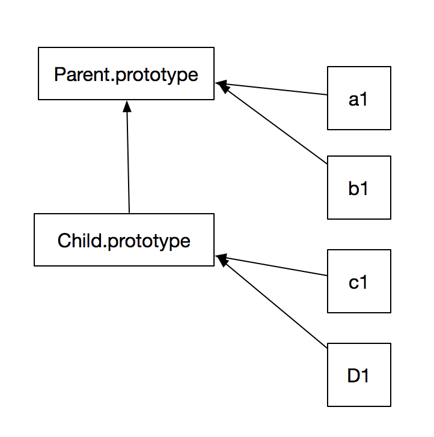

# JavaScript深入之继承

继承意味着复制操作，JavaScript并不会复制对象的属性。相反，JavaScript会在两个对象之间创建一个关联，这样一个对象就可以委托访问另一个对象的属性和函数。委托这个术语可以更加准确地描述JavaScript中对象的关联机制。

### JS继承关系



### 原型链继承方式

```js
function Parent () {}
function Child () {}
Child.prototype = new Parent()
```

### 组合继承方式

```js
function Parent () {}
function Child () {
    Parent.apply(this, arguments)
}
Child.prototype = new Parent()
Child.prototype.constructor = Parent
```

### 那么ES6中的extends和ES5实现的继承有什么区别呢

1. ES5的继承实质上是先创建子类的实例对象，然后再将父类的方法添加到this上
2. ES6的继承机制则完全不同，实质上是先创建父类的实例对象this，所以必须先调用super()方法，然后再用子类的构造函数修改this
3. ES6继承的子类必须在constructor（构造函数）中调用super()方法，否则新建实例会报错，因为子类没有自己的this对象，而是继承了父类的this对象，然后对其进行加工。

### 总结

ES5和ES6继承的最大区别：

- ES5先创建子类，在实例化父类并添加到子类this中
- ES6先创建父类，在实例化子类中通过调用super方法访问父类对象，在通过修改this实现继承
