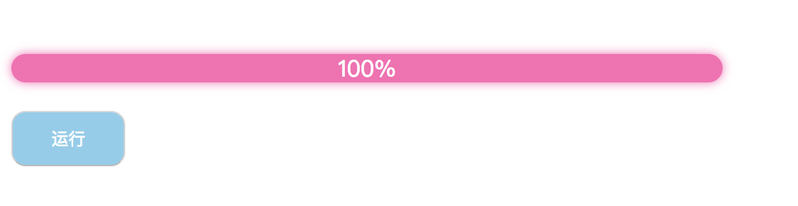

# requestAnimationFrame实现动画

在web应用中，实现动画的方式有很多种。
1. js使用setTimeout实现
2. css使用transition和animation实现
3. html5使用canvas实现
除此之外就是我们今天要介绍的requestAnimationFrame，从字面意思翻译来看，就是请求动画帧。

#### **屏幕刷新频率**
刷新频率即屏幕上的更新速度，或者说是屏幕上的图像每秒钟出现的次数，单位是赫兹（Hz），常见的电脑频率为60Hz。
显示器也会以每秒60次的频率正在不断的更新屏幕上的图像。为什么你感觉不到这个变化？ 那是因为人的眼睛有视觉停留效应，即前一副画面留在大脑的印象还没消失，紧接着后一副画面就跟上来了，这中间只间隔了**16.7ms(1000/60≈16.7)**， 所以会让你误以为屏幕上的图像是静止不动的。而屏幕给你的这种感觉是对的，试想一下，如果刷新频率变成1次/秒，屏幕上的图像就会出现严重的闪烁，这样就很容易引起眼睛疲劳、酸痛和头晕目眩等症状。


#### **requestAnimationFrame**
window.requestAnimationFrame() 方法告诉浏览器您希望执行动画并请求浏览器在下一次重绘之前调用指定的函数来更新动画。该方法使用一个回调函数作为参数，这个回调函数会在浏览器重绘之前调用。

与setTimeout相比，requestAnimationFrame最大的优势是由系统来决定回调函数的执行时机。具体一点讲，如果屏幕刷新率是60Hz,那么回调函数就每16.7ms被执行一次，如果刷新率是75Hz，那么这个时间间隔就变成了1000/75=13.3ms，换句话说就是，requestAnimationFrame的步伐跟着系统的刷新步伐走。它能保证回调函数在屏幕每一次的刷新间隔中只被执行一次，这样就不会引起丢帧现象，也不会导致动画出现卡顿的问题。

下面我们使用requestAnimationFrame实现进度条：
```html
<div class="box"></div>
<button class="btn">运行</button>
```
```css
.box {
  background: hotpink;
  width: 0;
  height: 20px;
  line-height: 20px;
  border-radius: 10px;
  color: #fff;
  box-shadow: 0 0 10px hotpink;
  text-align: center;
}

.btn {
  background: skyblue;
  padding: 10px;
  margin-top: 20px;
  outline: 0;
  color: #fff;
  border-radius: 10px;
}
```
```js
let timer
window.onload = () => {
  const btn = document.querySelector('.btn')
  const box = document.querySelector('.box')
  const width = 500
  function callback () {
    if (parseInt(box.style.width) < width) {
      box.style.width = parseInt(box.style.width) + 5 + 'px'
      box.innerHTML = parseInt(box.style.width) / (width / 100) + '%'
      timer = requestAnimationFrame(callback)
    } else {
      cancelAnimationFrame(timer)
    }
  }
  btn.onclick = () => {
    box.style.width = '0'
    cancelAnimationFrame(timer)
    timer = requestAnimationFrame(callback)
  }
}
```



除此之外，requestAnimationFrame还有以下两个优势：
- CPU节能：使用setTimeout实现的动画，当页面被隐藏或最小化时，setTimeout 仍然在后台执行动画任务，由于此时页面处于不可见或不可用状态，刷新动画是没有意义的，完全是浪费CPU资源。而requestAnimationFrame则完全不同，当页面处理未激活的状态下，该页面的屏幕刷新任务也会被系统暂停，因此跟着系统步伐走的requestAnimationFrame也会停止渲染，当页面被激活时，动画就从上次停留的地方继续执行，有效节省了CPU开销。

- 函数节流：在高频率事件(resize,scroll等)中，为了防止在一个刷新间隔内发生多次函数执行，使用requestAnimationFrame可保证每个刷新间隔内，函数只被执行一次，这样既能保证流畅性，也能更好的节省函数执行的开销。一个刷新间隔内函数执行多次时没有意义的，因为显示器每16.7ms刷新一次，多次绘制并不会在屏幕上体现出来。

#### **兼容性**
requestAnimationFrame的兼容性还有些问题，以后可能不会继续维护，所以可以通过polyfill的方式来兼容。
```js
;(function (window) {
  var lastTime = 0;
  var prefixes = 'webkit moz ms o'.split(' '); //各浏览器前缀

  var requestAnimationFrame = window.requestAnimationFrame;
  var cancelAnimationFrame = window.cancelAnimationFrame;

  var prefix;
  //通过遍历各浏览器前缀，来得到requestAnimationFrame和cancelAnimationFrame在当前浏览器的实现形式
  for( var i = 0; i < prefixes.length; i++ ) {
    if ( requestAnimationFrame && cancelAnimationFrame ) {
      break;
    }
    prefix = prefixes[i];
    requestAnimationFrame = requestAnimationFrame || window[ prefix + 'RequestAnimationFrame' ];
    cancelAnimationFrame  = cancelAnimationFrame  || window[ prefix + 'CancelAnimationFrame' ] || window[ prefix + 'CancelRequestAnimationFrame' ];
  }

  //如果当前浏览器不支持requestAnimationFrame和cancelAnimationFrame，则会退到setTimeout
  if ( !requestAnimationFrame || !cancelAnimationFrame ) {
    requestAnimationFrame = function( callback ) {
      var currTime = new Date().getTime();
      //为了使setTimteout的尽可能的接近每秒60帧的效果
      var timeToCall = Math.max( 0, 16 - ( currTime - lastTime ) ); 
      var id = window.setTimeout( function() {
      callback( currTime + timeToCall );
      }, timeToCall );
      lastTime = currTime + timeToCall;
      return id;
    };
    
    cancelAnimationFrame = function( id ) {
      window.clearTimeout( id );
    };
  }
  //得到兼容各浏览器的API
  window.requestAnimationFrame = requestAnimationFrame; 
  window.cancelAnimationFrame = cancelAnimationFrame;
})(window)
```
