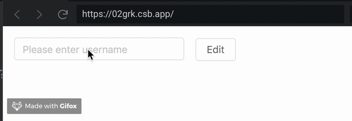
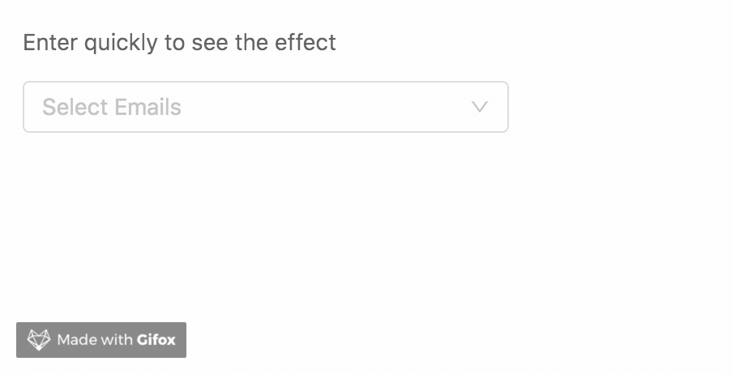
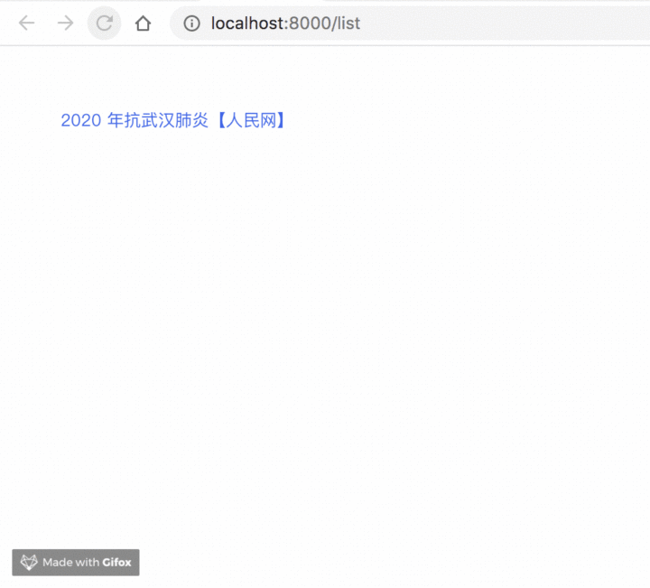
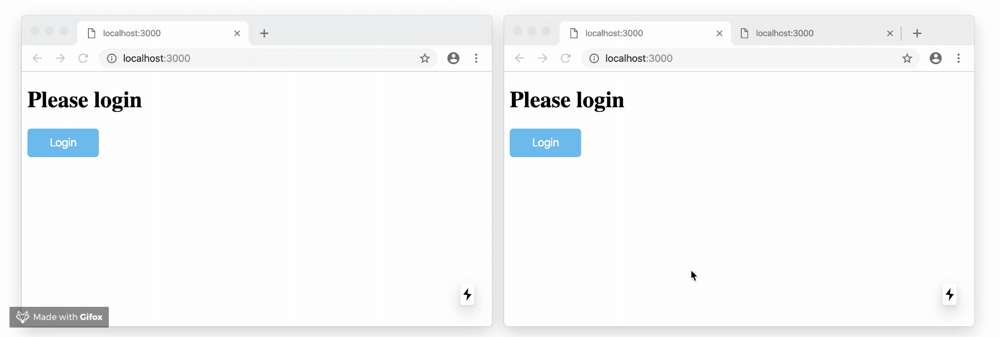
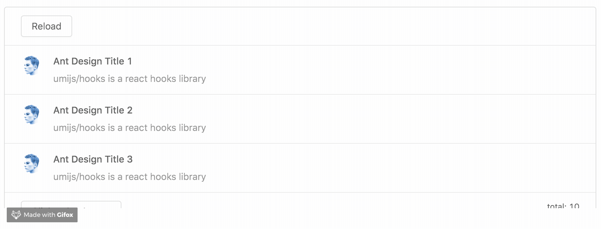

# useRequest-蚂蚁中台标准请求 Hooks

> useRequst 文档：[https://hooks.umijs.org/zh-CN/async](https://hooks.umijs.org/zh-CN/async)
> Umi Hooks Github 地址：[https://github.com/umijs/hooks](https://github.com/umijs/hooks)

useRequest 是一个超级强大，且生产完备的网络请求 Hooks，目前已经成为蚂蚁中台最佳实践内置网络请求方案。在蚂蚁内部中台应用，写网络请求，都推荐用 useRequest。

useRequest 可能是目前社区中最强大，最接地气的请求类 Hooks 了。可以覆盖 99% 的网络请求场景，无论是读还是写，无论是普通请求还是分页请求，无论是缓存还是防抖节流，通通都能支持。只有你想不到，没有它做不到（吹牛 ~）。

### 为什么要做 useRequest？

在组件开发中，要实现一个健壮的网络请求，并不是一个简单的事情。正如我上一篇文章《Umi Hooks - 助力拥抱 React Hooks》举的例子，实现一个网络请求，我们需要考虑 loading、竞态处理、组件卸载等等方面。

当然通过 React Hooks 的逻辑封装能力，我们可以将网络请求相关的逻辑封装起来。Umi Hooks 中的 useAsync 就做了这个事情，一行代码就可以实现网络请求，提效非常明显。

但日常工作中，只用一个 useAsync 还是不够的，Umi Hooks 中和网络请求相关的 Hooks 就有非常多。比如和分页请求相关的 usePagination，请求自带防抖的 useSearch，内置 umi-request 的 useAPI，加载更多场景的 useLoadMore，等等等等。

目前已有 Hooks 有几个很明显的缺点：

- 上手成本偏高，需要针对不同场景选择不同的 Hooks。
- 所有网络请求 Hooks API，底层能力不一致。比如 usePagination 不支持手动触发、不支持轮询等等。
- useAsync 能力不足，很多场景无法满足需求，比如并行请求。

同时随着 zeit/swr 的诞生，给了我们很多灵感，原来网络请求还可以这么玩！swr 有非常多好用，并且我们想不到的能力。比如：

- 屏幕聚焦重新发起请求。
- swr 能力。

> 这里我简单科普下 swr。swr 是 stale-while-revalidate 的简称，最主要的能力是：我们在发起网络请求时，会优先返回之前缓存的数据，然后在背后发起新的网络请求，最终用新的请求结果重新触发组件渲染。swr 特性在特定场景，对用户非常友好。

基于上面两点，经过内部多次讨论，最终决定，我们要做一个能力强大，覆盖所有场景的网络请求 Hooks！useRequest 诞生了！它不仅囊括了当前 Umi Hooks 中所有和网络请求相关的 Hooks 的能力，也大量借鉴了 swr 的优秀特性，香的不得了。

### 能力介绍

##### 基础网络请求

```js
import { useRequest } from '@umijs/hooks';
​
function getUsername() {
  return Promise.resolve('jack');
}
​
export default () => {
  const { data, error, loading } = useRequest(getUsername)
  
  if (error) return <div>failed to load</div>
  if (loading) return <div>loading...</div>
  return <div>Username: {data}</div>
}
```

这是一个最简单的网络请求示例。在这个例子中 useRequest 接收了一个 Promise 函数。在组件初始化时，会自动触发 getUsername 执行，并自动管理 data 、 loading 、 error 等数据，我们只需要根据状态来写相应的 UI 实现即可。

[在线 demo](https://hooks.umijs.org/zh-CN/hooks/async)

### 手动请求

对于“写”请求，我们一般需要手动触发，比如添加用户，编辑信息，删除用户等等。 useRequest 只需要配置 manual = true ，即可阻止初始化执行。只有触发 run 时才会开始执行。



```js
import { useRequest } from '@umijs/hooks';
​
export default () => {
  const { run, loading } = useRequest(changeUsername, {manual: true})
  
  return (
    <Button onClick={() => run('new name')} loading={loading}>
       Edit
    </Button>
    )
}
```

[在线 demo](https://hooks.umijs.org/zh-CN/hooks/async)

### 轮询

对于需要保持新鲜度的数据，我们通常需要不断发起网络请求以更新数据。 useRequest 只要配置 poilingInterval 即可自动定时发起网络请求。

```js
import { useRequest } from '@umijs/hooks';
​
export default () => {
  const { data } = useRequest(getUsername, { pollingInterval: 1000 })
​
  return <div>Username: {data}</div>
}
```

同时通过设置 pollingWhenHidden ，我们可以智能的实现在屏幕隐藏时，暂停轮询。等屏幕恢复可见时，继续请求，以节省资源。

当然你也可以通过 run/cancel 来手动控制定时器的开启和关闭。

[在线 demo](https://hooks.umijs.org/zh-CN/hooks/async)

### 并行请求

什么是并行请求？看了下图应该就明白了，也就是同一个接口，我们需要维护多个请求状态。

示例中的并行请求有几个特点：

- 删除 n 个不同的用户，则需要维护 n 个请求状态。
- 多次删除同一个用户，则只需要维护最后一个请求。


useRequest 通过设置 fetchKey ，即可对请求进行分类。相同分类的请求，只会维护一份状态。不同分类的请求，则会维护多份状态。在下面的代码中，我们通过 userId 将请求进行分类，同时我们可以通过 fetches[userId] 拿到当前分类的请求状态！

```js
export default () => {
  const { run, fetches } = useRequest(deleteUser, {
    manual: true,
    fetchKey: id => id, // 不同的 ID，分类不同
  });
​
  return (
    <div>
      <Button loading={fetches.A?.loading} onClick={() => { run('A') }}>删除 1</Button>
      <Button loading={fetches.B?.loading} onClick={() => { run('B') }}>删除 2</Button>
      <Button loading={fetches.C?.loading} onClick={() => { run('C') }}>删除 3</Button>
    </div>
  );
};
```

[在线 demo](https://hooks.umijs.org/zh-CN/hooks/async)

### 防抖 & 节流

通常在边输入边搜索的场景中，我们会用到防抖功能，以节省不必要的网络请求。通过 useRequest ，只需要配置一个 debounceInterval ，就可以非常简单的实现对网络请求的节流操作。



在下面的例子中，无论调用了多少次 run ，只会在输入停止后，发送一次请求。

```js
import { useRequest } from '@umijs/hooks';
​
export default () => {
  const { data, loading, run, cancel } = useRequest(getEmail, {
    debounceInterval: 500,
    manual: true
  });
​
  return (
    <div>
      <Select onSearch={run} loading={loading}>
        {data && data.map(i => <Option key={i} value={i}>{i}</Option>)}
      </Select>
    </div>
  );
};
```

节流与防抖是同样的道理，只需要配置了 throttleInterval ，即可实现节流功能。

[在线 demo](https://hooks.umijs.org/zh-CN/hooks/async)

### 缓存 & SWR & 预加载

在前面我讲了什么是 SWR，在 SWR 场景下，我们会对接口数据进行缓存，当下次请求该接口时，我们会先返回缓存的数据，同时，在背后发起新的网络请求，待新数据拿到后，重新触发渲染。

对于一些数据不是经常变化的接口，使用 SWR 后，可以极大提高用户使用体验。比如下面的图片例子，当我们第二次访问该文章时，直接返回了缓存的数据，没有任何的等待时间。同时，我们可以看到“最新访问时间”在 2 秒后更新了，这意味着新的请求数据返回了。



useRequest 通过配置 cacheKey ，即可进入 SWR 模式，相当简单。

```js
const { data, loading } = useRequest(getArticle, {
  cacheKey: 'articleKey',
});
```

同时需要注意，同一个 cacheyKey 的数据是全局共享的。通过这个特性，我们可以实现“预加载”功能。比如鼠标 hover 到文章标题时，我们即发送读取文章详情的请求，这样等用户真正点进文章时，数据早已经缓存好了。

[在线 demo](https://hooks.umijs.org/zh-CN/hooks/async)

### 屏幕聚焦重新请求

通过配置 refreshOnWindowFocus ，我们可以实现，在屏幕重新聚焦或可见时，重新发起网络请求。这个特性有什么用呢？它可以保证多个 tab 间数据的同步性。也可以解决长间隔之后重新打开网站的数据新鲜度问题。

这里借用 swr 的一个图来说明问题。



[在线 demo](https://hooks.umijs.org/zh-CN/hooks/async)

### 集成请求库

考虑到使用便捷性， useRequest 集成了 umi-request。如果第一个参数不是 Promise，我们会通过 umi-request 来发起网络请求。

当然如果你想用 axios，也是可以的，通过 requstMethod 即可定制你自己的请求方法。

```js
// 用法 1
const { data, error, loading } = useRequest('/api/userInfo');
​
// 用法 2
const { data, error, loading } = useRequest({
  url: '/api/changeUsername',
  method: 'post',
});
​
// 用法 3
const { data, error, loading, run } = useRequest((userId)=> `/api/userInfo/${userId}`);
​
// 用法 4
const { loading, run } = useRequest((username) => ({
  url: '/api/changeUsername',
  method: 'post',
  data: { username },
}));
```

[在线 demo](https://hooks.umijs.org/zh-CN/hooks/async)

### 分页

中台应用中最多的就是表格和表单了。对于一个表格，我们要处理非常多的请求逻辑，包括不限于：

- page、pageSize、total 管理
- 筛选条件变化，重置分页，重新发起网络请求

useRequest 通过配置 paginated = true ，即可进入分页模式，自动帮你处理表格常见逻辑，同时我们对 antd Table 做了特殊支持，只用简单几行代码，就可以实现下面图中这样复杂的逻辑，提效百倍。


```js
import {useRequest} from '@umijs/hooks';
​
export default () => {
  const [gender, setGender] = useState('male');
  const { tableProps } = useRequest((params)=>{
    return getTableData({...params, gender})
  }, {
    paginated: true,
    refreshDeps: [gender]
  });
​
  const columns = [];
​
  return (
    <Table columns={columns} rowKey="email" {...tableProps}/>
  );
};
```

[在线 demo](https://hooks.umijs.org/zh-CN/hooks/async)

### 加载更多

加载更多的场景也是日常开发中常见的需求。在加载场景中，我们一般需要处理：

- 分页 offset、pageSize 等管理
- 首次加载，加载更多状态管理
- 上拉自动加载更多
- 组件第二次加载时，希望能记录之前的数据，并滚动到之前的位置

useRequest 通过设置 loadMore = true ，即可进入加载更多模式，配合其它参数，可以帮你处理上面所有的逻辑。



```js
const { data, loading, loadMore, loadingMore } = useRequest((d) => getLoadMoreList(d?.nextId, 3), {
  loadMore: true,
  cacheKey: 'loadMoreDemoCacheId',
  fetchKey: d => `${d?.nextId}-`,
});
```

[在线 demo](https://hooks.umijs.org/zh-CN/hooks/async)

### 更多

当然我前面也说了， useReqeust 的功能只有你想不到，没有它没有的。哈哈哈~

除了上面的特性，我们还有一些其它的能力，可以在文档中发现。比如 loadingDelay。

### loadingDelay

通过设置 loadingDelay ，延迟 loading 变为 true 的时间，当请求很快响应时，可以有效避免 loading 变化导致的抖动。


### 总结

虽然 useRequest 的功能很多，也避免不了有些你想用的特性它不支持。但不用担心，你可以很方面的基于 useRequest 去扩展。我们的分页模式，及加载更多模式均是基于底层能力扩展实现的。你可以参考它们的代码，实现自己的特有能力。

通过 useRequest ，可以解决日常 99% 的网络请求需求。奥利给！奥利给！

