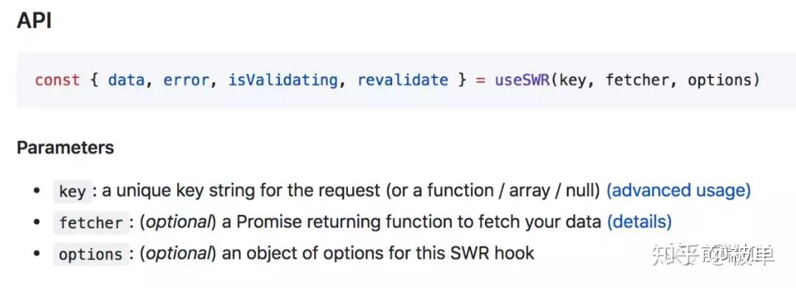

# 深入浅出之swr

> SWR 作为一个基于 react hook 的请求库, 目前 issue 和关注量都比较大。在实现方面也是有比较多亮点。本篇文章将结合 API 深入浅出了解SWR源码的实现.
官方文档: https://github.com/zeit/swr

PS: 本文阅读大概需要18分钟时间. 如对细节不关心可直接查看“有意思的实现” 了解作者做的优化点

目录

- 解析参数
- 依赖处理
- 全局配置
- 请求数据逻辑
- 回调处理
- 循环请求
- 缓存处理
- 总结

### 解析参数



从 API 来看, 接收3个参数, 我们再看看源码

```js
if (args.length >= 1) {
 _key = args[0]
}
if (typeof args[1] === 'function') {
 //如果第二个参数是函数, 则赋值给 fn
 fn = args[1]
} else if (typeof args[1] === 'object') {
 //如果第二个参数是对象, 则赋值给 config
 config = args[1]
} if (typeof args[2] === 'object') {
 config = args[2]
} if (typeof fn === 'undefined') {
 //若没传 fn , 则使用默认配置的函数
 fn = config.fetcher
}
```

从这段代码可以看出, 调用可以传 fetcher, 也可以不传 fetcher , 可以将
fetcher 的参数作为数组传递过去, 让调用更加灵活.
```也将请求和常用的处理逻辑分隔开来. 达到解耦的效果.```


```js
const { data } = useSWR( key, fetcher, options)
const { data } = useSWR('/api/user', { refreshInterval: 0 }) 
const { data } = useSWR(shouldFetch ? '/api/data' : null, fetcher) //条件取key值
const { data } = useSWR(() => '/api/projects?uid=' + id) //key 为函数
useSWR(['/api/user', params], fetcher) // key 为数组
```

第一个参数 key 可以传递字符串, 可以传递数组, 也可以传递一个函数.

```js
const getKeyArgs = key => {
  let args = null
  if (typeof key === 'function') {
    try {
      key = key()
    } catch (err) {
      // 如果拿到依赖的值仍未解析到, 会抛出错误,则表示依赖还未好
      key = ''
    }
  }
  if (Array.isArray(key)) {
    args = key
    key = hash(key)
  } else {
    key = String(key || '') // 若解析不到值, 则表示依赖未好或使用方式错误
  }
  return [key, args] // 解析到的参数作为第二个函数的入参
}
```

tips: 直接用 key 值来做唯一的标识, 如果传递的数组中有对象,每次都会重新创建对象, 都是一个不一样的值,key值发生变化,就会进入死循环.
解决方法是使用 useMemo, 如下:

```js
const params = useMemo(() => ({ id }), [id])useSWR(['/api/user', params], fetcer)
```

### 依赖处理

这里有一个很有意思的地方.同样的, 我们先看看 API. 第二个请求一定可以保证在第一个请求结束后再发出.

```js
const { data: user } = useSWR('/api/user')
const { data: projects } = useSWR(() => '/api/projects?uid=' + user.id)
```

用短短几行代码, 便实现了一个依赖请求. 在解析参数的时候, 若拿不到依赖的值, 则报错进入catch流程. 如下:

```js
if (typeof key === 'function') {
    try {
      key = key()
    } catch (err) {
      // 如果拿到依赖的值仍未解析到, 会抛出错误,则表示依赖还未好
      key = ''
    }
}
```

在处理获取接口的函数里. 若 key 为 ‘’ , 则不做任何处理, 当依赖的接口返回了数据, 第二个接口的依赖值 key 发生了改变, 便重新触发发起请求.

```js
const revalidate = useCallback(async(revalidateOpts) => {
    if (!key) return false //没有key值则直接返回
},[key]) // 当依赖项 key 变化时 useCallback 会重新执行
```

### 全局配置

接下来我们看到配置参数的获取和初始化, 这里除了 swr 自己默认的 defaultConfig 之外, 还使用了 useContext .

```js
const defaultConfig: ConfigInterface = {
  onLoadingSlow: () => {},
  onSuccess: () => {},
  onError: () => {},
  onErrorRetry,
  errorRetryInterval: 5 * 1000,
  focusThrottleInterval: 5 * 1000,
  dedupingInterval: 2 * 1000,
  loadingTimeout: 3 * 1000,
  refreshInterval: 0,
  revalidateOnFocus: true,
  refreshWhenHidden: false,
  shouldRetryOnError: true,
  suspense: false
}
config = Object.assign(
    {},
    defaultConfig,
    useContext(SWRConfigContext),
    config
)
```

其实按照以往写公共组件的方法, 我们可能会用类, 然后写一个静态 static 方法, 让用户调用这个静态方法, 全局初始化数据.
但 swr 明显不可能使用 class , 这里使用了 Context 来配置全局数据共享.
我们依然结合他的 api 来看.

```js
import useSWR, { SWRConfig } from 'swr'
function App () {
  return (
    <SWRConfig 
      value={{
        refreshInterval: 3000,
      }}
    >
      组件..
    </SWRConfig>
  )
}
```

##### 有意思的实现

从 swr 里面引入了 SWRConfig ,那我们找一下源码里面的内容. 对外暴露了一个 Provider, 外部直接接收一个 value 属性, 内部使用
useContext(SWRConfigContext) 获取对应的参数.

```js
const SWRConfigContext = createContext<ConfigInterface>({}) 
SWRConfigContext.displayName = 'SWRConfigContext'
const SWRConfig = SWRConfigContext.Provider
export { SWRConfig }
```

```小tip: 若自己尝试封装基于 hook 的组件, 通用的配置方式可以参考这种方式.```

### 请求数据逻辑

先列一个大概的轮廓, 核心的步骤如下:
1. 将相关的请求处理放在 revalidate 中,用 useCallback 根据 key 值做缓存. key 值为入参.
2. 在 useIsomorphicLayoutEffect 时,若有缓存则优先使用缓存数据, 再异步调用并更新数据.

```js
let [state, dispatch] = useReducer(mergeState, {
    data: initialData,
    error: initialError,
    isValidating: false
}) // 使用 reducer 的方式修改数据
const [key, fnArgs] = getKeyArgs(_key) //内部的代码在参数解析部分有讲
const unmountedRef = useRef(false)  //缓存 mounted 的状态
const revalidate = useCallback(async(revalidateOpts) => {
    if (unmountedRef.current) return false
    try {
        // 请求超时触发 onLoadingSlow 回调函数
        // 将请求记录到 CONCURRENT_PROMISES 对象
        if (fnArgs !== null) {
            CONCURRENT_PROMISES[key] = fn(...fnArgs) //将传的参数传递过去
        } else {
            CONCURRENT_PROMISES[key] = fn(key)
        }
        // 执行请求
        newData = await CONCURRENT_PROMISES[key]
        // 请求成功时的回调
        config.onSuccess(newData, key, config)
        // 将请求结果存储到缓存 cache 中
        cacheSet(key, newData)
        // 对比新旧数据,若数据发生改变, 则批量改变数据
        if (deepEqual(dataRef.current, newData)) {} else {
            newState.data = newData
            dataRef.current = newData
        }
        dispatch(newState)
    }catch(err) {
        // 请求失败设置值
        // 请求失败时回调
        // 根据配置判断是否重试请求
    }
},[key]) // 当依赖项 key 变化时 useCallback 会重新执行
useIsomorphicLayoutEffect = IS_SERVER ? useEffect : useLayoutEffect //根据服务端客户端选择 useEffect 还是 useLayoutEffect
useIsomorphicLayoutEffect(() => {
    unmountedRef.current = false
    const softRevalidate = () => revalidate()
    if (
      typeof latestKeyedData !== 'undefined' &&
      window['requestIdleCallback']
    ) {
      // 如果有缓存则延迟重新验证，优先使用缓存数据进行渲染
      window['requestIdleCallback'](softRevalidate)
    } else {
      softRevalidate()
    }
    // 窗口聚焦时,重新验证
    // 注册全局缓存的更新监听函数
    // 根据配置的 refreshInterval 循环请求
    return () => {
        // 清除副作用
        unmountedRef.current = true
    }
}, [key, config.refreshInterval, revalidate])
return {
    error,
    data,
    revalidate,
    isValidating
}
```

##### 有意思的实现

1. 之前版本的 swr 使用的是 unstable_batchedUpdates 来进行批量处理. . 此处使用了 useReducer 来优化批量修改数据, 若无使用此方法, 会导致修改 loading, data 数据引起了2次渲染.
2. 使用 useCallback 接收key值, 若key值不变, 则可以使用上次的函数. 提高了性能.
3. 使用 useRef 来存储 unmountedRef 值, 在组件卸载的时候, 不再 setState, 解决了组件卸载之后, 接口请求回来 setState 的错误.
4. 使用 useLayoutEffect 在 ui 渲染前开始触发请求, 稍微提高了速度. 并且兼容了服务端渲染的情况.
5. 请求函数被 requestIdleCallback 包裹, 非阻塞.
6. 将发起请求的处理放在 revalidate 中, 方便回调及各种调用.

### 回调处理

在请求的时候, 我们经常有一些定制化的需求, 比如“接口错误后需要展示什么数据”, “接口错误后重试多少次”, 如果每个接口都需要写一遍, 那真的太难受了. 同样的, 我们看一下调用的 API

```js
useSWR(key, fetcher, {
  onErrorRetry: (error, key, option, revalidate, { retryCount }) => {
    if (retryCount >= 10) return
    if (error.status === 404) return
    // 5秒后重试
    setTimeout(() => revalidate({ retryCount: retryCount + 1 }), 5000)
  }
})
```

这块的源码很简单. 就是在接口错误的时候, 调用传递进来的 onErrorRetry 函数.

```js
if (config.shouldRetryOnError) {
    const retryCount = (revalidateOpts.retryCount || 0) + 1
    config.onErrorRetry(err,key,config, revalidate, Object.assign({ dedupe: true }, revalidateOpts, { retryCount })) // 默认设置 dedupe 为 true , 配置可以设置在指定时间内如果发起同样的请求, 则不请求. 
}
```

这里注意的是, 若你不重写onErrorRetry函数,则按照它默认的方式(指数回退算法)来处理. emmm……源码如下:

```js
const count = Math.min(opts.retryCount || 0, 8);
const timeout =
  ~~((Math.random() + 0.5) * (1 << count)) * config.errorRetryInterval;
```

循环请求跟 error 回调错误处理一样, 这里都是默认 dedupe 为 true .

```js
useIsomorphicLayoutEffect(() => {
const softRevalidate = () => revalidate({ dedupe: true })
let timeout = null
if (config.refreshInterval) {
    const tick = async () => {
        if (!errorRef.current && (config.refreshWhenHidden || isDocumentVisible())
        ) {
          // 页面可视时, 且接口未错误时, 发起请求. //如果你想让接口错误的时候也继续循环, 那得在 onError 里面处理
          await softRevalidate()
        }
        const interval = config.refreshInterval
        timeout = setTimeout(tick, interval)
    }
    timeout = setTimeout(tick, config.refreshInterval)
}
}, [key, config.refreshInterval, revalidate]) //循环参数发生变化时,重新执行
```

从上面基本的轮廓已经可以看到是如何发起一个请求, 以及如何拿到数据. 假若你的 hook 请求库不需要做缓存, 使用上面的轮廓基本上就可以满足业务需求了.

##### 缓存处理

不过很明显,这个库主打的是 “stale-while-revalidate ”: 旨在通过缓存提高用户体验。其核心就是允许```客户端先使用缓存中不新鲜的数据，然后在后台异步重新验证更新缓存，等下次使用的时候数据就是新的了，```
即在请求之前先从缓存返回数据（stale），然后在异步发送请求，最后当数据返回时更新缓存并触发 UI 的重新渲染，从而提高用户体验。

##### 有意思的实现

核心: 因为我们需要使用到缓存(旧的数据),必然得有个变量来存储接口返回的数据于内存中. 这里使用的是 cacheGet ， 根据值 key 来做索引。

```js
const initialData =
    (shouldReadCache ? cacheGet(key) : undefined) || config.initialData
const initialError = shouldReadCache ? cacheGet(keyErr) : undefined
const revalidate = useCallback(
    async () => {
    try {
        //发起请求
        const newData = await CONCURRENT_PROMISES[key] //存入并发的数组中, 可过参数dedupingInterval控制并发量
        // 将请求结果存储到缓存 cache 中
        cacheSet(key, newData)
        cacheSet(keyErr, undefined)
        keyRef.current = key
    }catch(err) {
        cacheSet(keyErr, err)
        keyRef.current = key
    }
    }, [key])
useIsomorphicLayoutEffect(() => {
const latestKeyedData = cacheGet(key) || config.initialData
// 如果有最新的数据, 则等浏览器空闲的时候再重新发起请求. 
if (
      typeof latestKeyedData !== 'undefined' &&
      !IS_SERVER &&
      window['requestIdleCallback']
    ) {
      window['requestIdleCallback'](softRevalidate)
    } else {
      softRevalidate()
    }
}, [key, config.refreshInterval, revalidate]) 
```

总结：该库还有其他的一些实现， 大同小异， 感兴趣可以看看源码～
