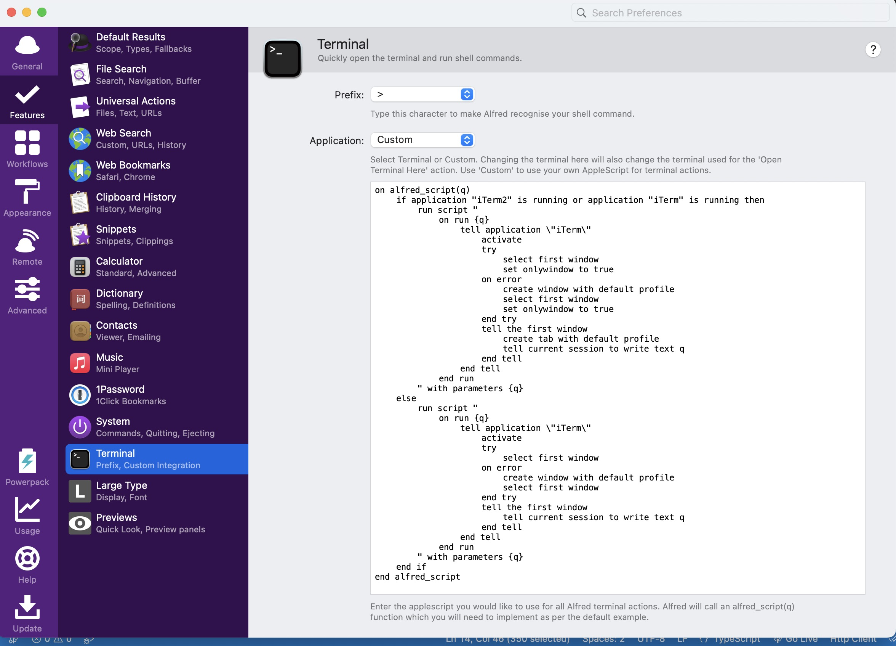
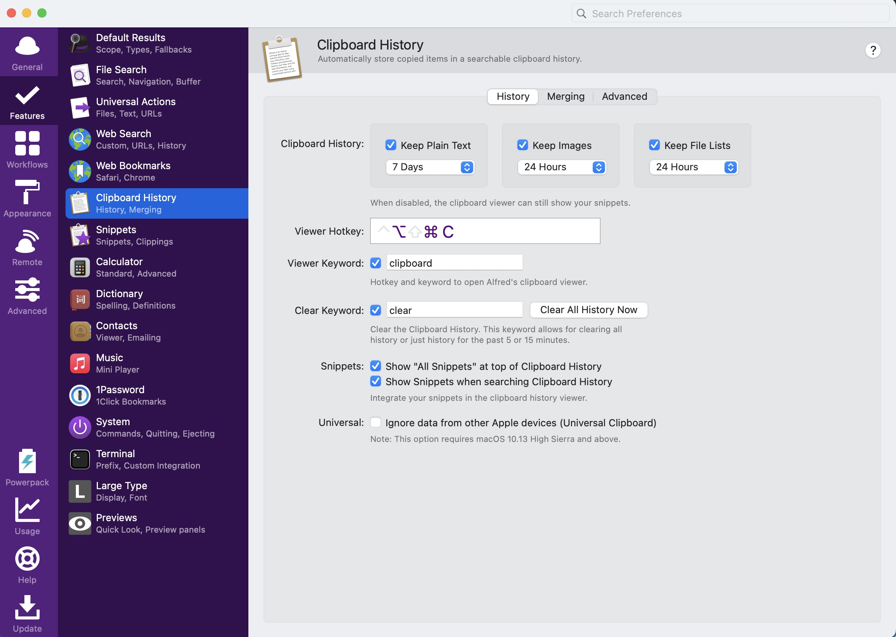

# Alfred

### 自定义terminal为Iterm2

```
on alfred_script(q)
	if application "iTerm2" is running or application "iTerm" is running then
		run script "
			on run {q}
				tell application \"iTerm\"
					activate
					try
						select first window
						set onlywindow to true
					on error
						create window with default profile
						select first window
						set onlywindow to true
					end try
					tell the first window
						create tab with default profile
						tell current session to write text q
					end tell
				end tell
			end run
		" with parameters {q}
	else
		run script "
			on run {q}
				tell application \"iTerm\"
					activate
					try
						select first window
					on error
						create window with default profile
						select first window
					end try
					tell the first window
						tell current session to write text q
					end tell
				end tell
			end run
		" with parameters {q}
	end if
end alfred_script
```



### 剪贴板Clipboard Hisotry

可以通过Command+option+C打开剪贴板历史，需要先勾选对应的Keep Plain Text, Keep Images,Keep File Lists

