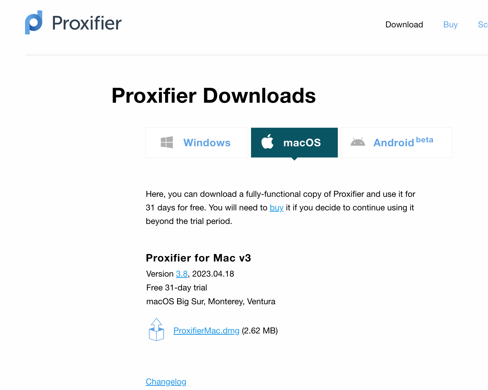

# 常用软件链接汇总

### clashX

[https://github.com/yichengchen/clashX](https://github.com/yichengchen/clashX)

规则列表网址:

```bash
https://raw.githubusercontent.com/gfwlist/gfwlist/master/gfwlist.txt
```

### SwitchHosts

[https://github.com/oldj/SwitchHosts](https://github.com/oldj/SwitchHosts)


### Proxifier

[https://www.proxifier.com/download/#mac-tab](https://www.proxifier.com/download/#mac-tab)



Mac V3 注册码

```bash
3CWNN-WYTP4-SD83W-ASDFR-84KEA
```

windows 激活码生成工具：

```bash
https://github.com/Danz17/Proxifier-Keygen
```

### Homebrew

[https://brew.sh/](https://brew.sh/)

### fnm（node 包管理器）

[https://github.com/Schniz/fnm](https://github.com/Schniz/fnm)

### Alfred（Mac 效率提升工具）

[https://www.alfredapp.com/](https://www.alfredapp.com/)

### Downie4（视频下载工具）

官网：
[https://software.charliemonroe.net/downie/](https://software.charliemonroe.net/downie/)

破解版：
[https://www.macyy.cn/archives/104#J_DLIPPCont](https://www.macyy.cn/archives/104#J_DLIPPCont)
