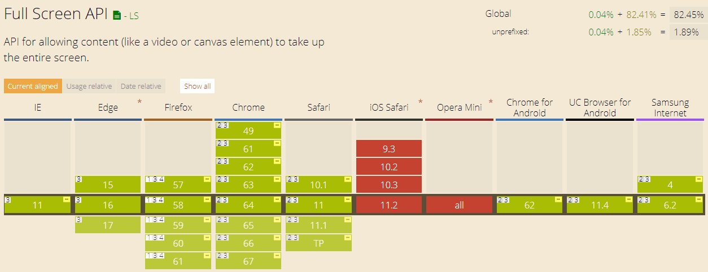

# HTML5 之全屏（Full Screen API）

技术日新月异，各大浏览器对 HTML5 的支持也越来越好，我们不妨大胆的使用 HTML5 API 来提升用户体验。这一节我们来看看 Full Screen API 的使用及原理。

### 一、使用场景

1.当我们看视频的时候，为提升用户体验，可能会需要视频窗口全屏化；
2.如果你恰好在对接地图业务，一张全屏的地图可能会更有视觉冲击力；
3.动态展示图片或动画全屏预览；

场景很多，但是使用 Full Screen API 一行代码就搞定了：

```js
$('.your-container')[0].webkitRequestFullscreen();
```

是不是很酷，当然，这只适用与 webkit 内核浏览器的情况，而且还是最理想状态👻。

### 二、浏览器支持情况



> 可以看到，基本上所有浏览器都支持了，除了 iOS Safari 和 Opera Mini ，所以移动端应用需谨慎。

### 三、参数详解

- 检测全屏是否可用

```js
//full-sreen available
if(
  document.fullscreenEnable||
  document.webkitFullscreenEnabled||
  document.mozFullScreenEnabled||
  document.msFullscreenEnabled
){
...
}
```

- 全屏：

```js
var i = document.getElementById(myimage);
// go full-screen
if (i.requestFullscreen) {
    i.requestFullscreen();
} else if (i.webkitRequestFullscreen) {
    i.webkitRequestFullscreen();
} else if (i.mozRequestFullScreen) {
    i.mozRequestFullScreen();
} else if (i.msRequestFullscreen) {
    i.msRequestFullscreen();
}
```

- 退出全屏：

```js
// exit full-screen
if (document.exitFullscreen) {
    document.exitFullscreen();
} else if (document.webkitExitFullscreen) {
    document.webkitExitFullscreen();
} else if (document.mozCancelFullScreen) {
    document.mozCancelFullScreen();
} else if (document.msExitFullscreen) {
    document.msExitFullscreen();
}
```

- 当进入或者退出全屏模式时将触发这个事件:

```js
document.addEventListener(fullscreenchange, FShandler);
document.addEventListener(webkitfullscreenchange, FShandler);
document.addEventListener(mozfullscreenchange, FShandler);
document.addEventListener(MSFullscreenChange, FShandler);
```

- 全屏操作可能会失败。例如 iframes 没有 allowfullscreen 属性或者是以窗口形式显示的内容也许会引起冲突。因此一个 fullscreenerror 也许会被触发：

```js
document.addEventListener(fullscreenerror, FSerrorhandler);
document.addEventListener(webkitfullscreenerror, FSerrorhandler);
document.addEventListener(mozfullscreenerror, FSerrorhandler);
document.addEventListener(MSFullscreenError, FSerrorhandler);
```

### 四、全屏中添加 CSS 样式

全屏后，我们也可以控制元素样式，请注意 -webkit-full-screen 伪类：

```js
#jartto:-webkit-full-screen {
  width: 100%;
  height: 100%;
  background: yellow;
}
```

不同的浏览器会添加不同的伪类，使用时一定要注意兼容性：

```js
:-webkit-full-screen { }
:-moz-full-screen { }
:-ms-fullscreen { }
:fullscreen { }
```

### 五、更多示例

1.全屏视频元素：

```js
<video controls id="myvideo">
  <source src="somevideo.webm"></source>
  <source src="somevideo.mp4"></source>
</video>
```

```js
var elem = document.getElementById("myvideo");
if (elem.requestFullscreen) {
  elem.requestFullscreen();
}
```

2.监听 enter 按键：

```js
document.addEventListener("keydown", function(e) {
  if (e.keyCode == 13) {
    toggleFullScreen();
  }
}, false);
```

3.全屏／退出全屏切换

```js
function toggleFullScreen() {
  if (!document.fullscreenElement) {
      document.documentElement.requestFullscreen();
  } else {
    if (document.exitFullscreen) {
      document.exitFullscreen();
    }
  }
}
```

### 六、插件源码分析

既然 Full Screen API 使用如此简单，那么为什么有人为此写了插件？我们带着问题来看看几个流行的全屏插件的源码，尝试着自己找出答案。

源码很简单，我们来过一遍：
1.先来看看 fscreen：

- 确定是否存在 window.document 对象

```js
const document = typeof window !== 'undefined' && typeof window.document !== 'undefined' ? window.document : {};
```

- 大量的兼容检测

```js
const webkit = [
  'webkitFullscreenEnabled',
  'webkitFullscreenElement',
  'webkitRequestFullscreen',
  'webkitExitFullscreen',
  'webkitfullscreenchange',
  'webkitfullscreenerror',
];
const vendor = (
  ('fullscreenEnabled' in document && Object.keys(key)) ||
  (webkit[0] in document && webkit) ||
  (moz[0] in document && moz) ||
  (ms[0] in document && ms) ||
  []
);
```

- 封装方法支持

1.requestFullscreen
2.fullscreenEnabled
3.fullscreenElement
4.onfullscreenchange
5.onfullscreenerror

2.再来看看 screenful ，相比来说，screenfull.js 做的更加完善：

> 需要注意的是，参数 Element.ALLOW_KEYBOARD_INPUT 使全屏状态中可以键盘输入。

- 增加了 commonjs 和 键盘事件嗅探

```js
var isCommonjs = typeof module !== 'undefined' && module.exports;
var keyboardAllowed = typeof Element !== 'undefined' && 'ALLOW_KEYBOARD_INPUT' in Element;
```

- 核心代码片段，相比 fscreen 感觉更加清晰易懂

```js
var screenfull = {
  request: function (elem) {
    var request = fn.requestFullscreen;

    elem = elem || document.documentElement;

    // Work around Safari 5.1 bug: reports support for
    // keyboard in fullscreen even though it doesn't.
    // Browser sniffing, since the alternative with
    // setTimeout is even worse.
    if (/ Version\/5\.1(?:\.\d+)? Safari\//.test(navigator.userAgent)) {
      elem[request]();
    } else {
      elem[request](keyboardAllowed && Element.ALLOW_KEYBOARD_INPUT);
    }
  },
  exit: function () {
    document[fn.exitFullscreen]();
  },
  toggle: function (elem) {
    if (this.isFullscreen) {
      this.exit();
    } else {
      this.request(elem);
    }
  },
  onchange: function (callback) {
    this.on('change', callback);
  },
  onerror: function (callback) {
    this.on('error', callback);
  },
  on: function (event, callback) {
    var eventName = eventNameMap[event];
    if (eventName) {
      document.addEventListener(eventName, callback, false);
    }
  },
  off: function (event, callback) {
    var eventName = eventNameMap[event];
    if (eventName) {
      document.removeEventListener(eventName, callback, false);
    }
  },
  raw: fn
};
```

### 七、总结

到这里，大家可能都明白了，其实 HTML5 Full Screen API 的使用很简单，但浏览器的差异导致我们不得不添加很多的兼容代码。所以，如果你不想自己维护代码，可以使用 screenfull.js 这样的类库，它可以平滑过渡这些差异。

### 八、更多资源

[Fullscreen API](https://developer.mozilla.org/en-US/docs/Web/API/Fullscreen_API)
[How to Use HTML5 FUll Screen API](https://www.2cto.com/kf/201411/348423.html)
