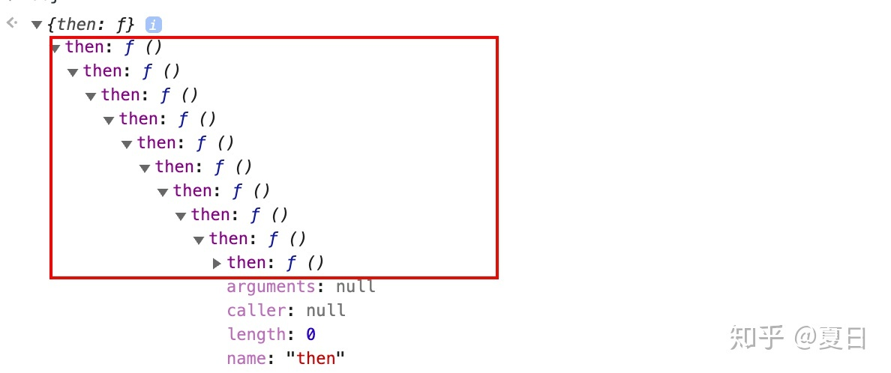

# Promise A+实现

### 介绍

promise表示一个异步操作的最终结果。和一个promise进行交互的主要方式是通过它的then方法，该方法注册回调要么接收一个promise的最终值，要么接收promise为什么不能被满足的原因。

这个规范详细描述了then方法的行为，提供了一个可交互操作的基础，所有的符合promise/A+规范的promise的都可以依靠该基础来实现。因此，这个规范应该被认为是十分稳定的。尽管Promise/A+组织可能会偶尔地通过一些较小的向后兼容的改变修订规范，来解决新发现的一些边界情况。但是，只有在经过仔细的考虑、讨论和测试后，我们才会集成大的或者向后不兼容的更改。

从历史上来说，Promise/A+阐明了早期Promise/A 提案的行为条款，扩展了原有规范约定俗成的行为，并且省略了没有被指定或者有问题的部分。

最终，Promise/A+规范没有处理如何创建、满足或拒绝promises,而是选择去专注于提供一个可交互操作的then方法。未来在相关规范的工作中可能会提到这些话题。

### 1.术语

1.1. promise: 一个拥有符合这个规范的行为的then方法的对象或函数。
1.2. thenable: 定义了一个then方法的对象或函数。
1.3. 值(value): 任意合法的JavaScript值(包括undefined,thenable,promise)。
1.4. 异常(exception): 使用throw语句抛出的一个值
1.5. 原因(reason): 表示promise为什么被拒绝的一个值

### 2. 必要条件

##### 2.1. Promise 状态

promise必须是这三个状态中的一种：等待态pending,解决态fulfilled或拒绝态rejected

##### 2.1.1. 当一个promise处于等待状态的时候：

2.1.1.1. 可能变为解决或者拒绝状态。

##### 2.1.2. 当一个promise处于解决状态的时候：

2.1.2.1. 一定不能转换为任何其它状态
2.1.2.2. 必须有一个不能改变的值

##### 2.1.3. 当一个promise处于拒绝状态的时候：

2.1.3.1. 一定不能转换为任何其它状态
2.1.3.2. 必须有一个不能改变的值
在这里，"一定不能改变"意味着不变的身份(例如 ===)，但是并不意味着深度不可变性。(译注者：这里应该是说只要值的引用相同即可，并不需要引用中的每一个值都相等)

##### 2.2. then 方法

Promise必须提供一个then方法来访问当前或最终的值或原因。

Promise的then方法接受俩个参数：

promise.then(onFulfilled, onRejected)
2.2.1 onFulfilled和onRejected都是可选的参数
2.2.1.1. 如果onFulfilled不是一个函数，它必须被忽略
2.2.1.2. 如果onRejected不是一个函数，它必须被忽略

##### 2.2.2. 如果onFulfilled是一个函数

2.2.2.1. 它必须在promise被解决后调用，promise的值作为它的第一个参数。
2.2.2.2. 它一定不能在promise被解决前调用。
2.2.2.3. 它一定不能被调用多次。

##### 2.2.3. 如果onRejected是一个函数

2.2.3.1. 它必须在promise被拒绝之后调用，用promise的原因作为它的第一个参数。
2.2.3.2. 它一定不能在promise被拒绝之前调用。
2.2.3.3. 它一定不能被调用多次。

##### 2.2.4. 在执行上下文栈中只包含平台代码之前，onFulfilled或onRejected一定不能被调用 [3.1]

##### 2.2.5. onFulfilled和onRejected一定被作为函数调用(没有this值) [3.2]

##### 2.2.6. 同一个promise上的then可能被调用多次

2.2.6.1. 如果promise被解决，所有相应的onFulfilled回调必须按照他们原始调用then的顺序执行
2.2.6.2. 如果promise被拒绝，所有相应的onRejected回调必须按照他们原始调用then的顺序执行

##### 2.2.7. then必须返回一个promise [3.3]

promise2 = promise1.then(onFulfilled,onRejected)
2.2.7.1. 如果onFulfilled或onRjected返回一个值x，运行promise解决程序[[Resolve]](promise2,x)
2.2.7.2. 如果onFulfilled或onRejected抛出一个异常e，promise2必须用e作为原因被拒绝
2.2.7.3. 如果onFulfilled不是一个函数并且promise1被解决，promise2必须用与promise1相同的值被解决
2.2.7.4. 如果onRejected不是一个函数并且promise1被拒绝，promise2必须用与promise1相同的原因被拒绝

##### 2.3. Promise解决程序

promise解决程序是一个抽象操作，它以一个promise和一个值作为输入，我们将其表示为[[Resolve]](promise, x)。如果x是一个thenable，它尝试让promise采用x的状态，并假设x的行为至少在某种程度上类似于promise。否则，它将会用值x解决 promise。

这种thenable的特性使得Promise的实现更具有通用性：只要其暴露一个遵循Promise/A+协议的then方法即可。这同时也使遵循Promise/A+规范的实现可以与那些不太规范但可用的实现能良好共存。

要运行[[Resolve]](promise, x)，需要执行如下步骤：

2.3.1. 如果promise和x引用同一个对象，用一个TypeError作为原因来拒绝promise
2.3.2. 如果x是一个promise，采用它的状态：[3.4]
2.3.2.1. 如果x是等待态，promise必须保持等待状态，直到x被解决或拒绝
2.3.2.2. 如果x是解决态，用相同的值解决promise
2.3.2.3. 如果x是拒绝态，用相同的原因拒绝promise

2.3.3. 否则，如果x是一个对象或函数
2.3.3.1. 让then成为x.then。[3.5]
2.3.3.2. 如果检索属性x.then导致抛出了一个异常e，用e作为原因拒绝promise
2.3.3.3. 如果then是一个函数，用x作为this调用它。then方法的参数为俩个回调函数，第一个参数叫做resolvePromise，第二个参数叫做rejectPromise：
2.3.3.3.1. 如果resolvePromise用一个值y调用，运行[[Resolve]](promise, y)。译者注：这里再次调用[[Resolve]](promise,y)，因为y可能还是promise
2.3.3.3.2. 如果rejectPromise用一个原因r调用，用r拒绝promise。译者注：这里如果r为promise的话，依旧会直接reject，拒绝的原因就是promise。并不会等到promise被解决或拒绝
2.3.3.3.3. 如果resolvePromise和rejectPromise都被调用，或者对同一个参数进行多次调用，那么第一次调用优先，以后的调用都会被忽略。译者注：这里主要针对thenable，promise的状态一旦更改就不会再改变。
2.3.3.3.4. 如果调用then抛出了一个异常e,
2.3.3.4.1. 如果resolvePromise或rejectPromise已经被调用，忽略它
2.3.3.4.2. 否则，用e作为原因拒绝promise
2.3.3.4. 如果then不是一个函数，用x解决promise

##### 2.3.4. 如果x不是一个对象或函数，用x解决promise

如果promise用一个循环的thenable链解决，由于[[Resolve]](promise, thenalbe)的递归特性，最终将导致[[Resolve]](promise, thenable)被再次调用，遵循上面的算法将会导致无限递归。规范中并没有强制要求处理这种情况，但也鼓励实现者检测这样的递归是否存在，并且用一个信息丰富的TypeError作为原因拒绝promise。[3.6]

译者注：这里的循环thenable可能是指如下情况：

```js
const obj = {
    then:function() { 
      //...    
    }
}
obj.then.then = obj.then
```

这样obj对象中的then将会形成一个环，可以一直无限循环调用.then方法。(类似于window全局对象，window.window依旧是window自己)



由于resolvePromise方法中会对返回值(参数x)的类型进行判断，这样会导致返回值的类型一直为promise,即无限循环调用resolvePromise。
resolvePromise递归调用参考

### 3. 注解

- 3.1. 这里“平台代码”意味着引擎、环境以及promise的实现代码。在实践中，这需要确保onFulfilled和onRejected异步地执行，并且应该在then方法被调用的那一轮事件循环之后用新的执行栈执行。这可以用如setTimeout或setImmediate这样的“宏任务”机制实现，或者用如MutationObserver或process.nextTick这样的“微任务”机制实现。由于promise的实现被考虑为“平台代码”，因此在自身处理程序被调用时可能已经包含一个任务调度队列。
- 3.2. 严格模式下，它们中的this将会是undefined；在非严格模式，this将会是全局对象。
- 3.3. 假如实现满足所有需求，可以允许promise2 === promise1。每一个实现都应该记录是否能够产生promise2 === promise1以及什么情况下会出现promise2 === promise1。
- 3.4. 通常，只有x来自于当前实现，才知道它是一个真正的promise。这条规则允许那些特例实现采用符合已知要求的Promise的状态。
- 3.5. 这个程序首先存储x.then的引用，之后测试那个引用，然后再调用那个引用，这样避免了多次访问x.then属性。此类预防措施对于确保访问者属性的一致性非常重要，因为访问者属性的值可能在俩次检索之间发生变化。
- 3.6. 实现不应该在thenable链的深度上做任意限制，并且假设超过那个任意限制将会无限递归。只有真正的循环才应该引发一个TypeError；如果遇到一个无限循环的thenable，永远执行递归是正确的行为。

### 代码实现

```js
const PENDING = 'pending'
const FULLFILLED = 'fullfilled'
const REJECTED = 'rejected'
const isFn = fn => typeof fn === 'function'
const isDef = val => val !== null && val !== void 0
class Promise {
  constructor(executor) {
    if (!isFn(executor)) throw new Error('Promise must receive a function for parameter')
    this.status = PENDING
    this.value = void 0
    this.reason = void 0
    this.onFullfilledCallbacks = []
    this.onRejectedCallbacks = []
    // on resolve
    const resolve = value => {
      if (value instanceof Promise) {
        return value.then(resolve, reject)
      }
      setTimeout(_ => {
        if (this.status !== PENDING) return
        this.status = FULLFILLED
        this.value = value
        this.onFullfilledCallbacks.forEach(cb => cb(this.value))
      })
    }
    // on reject
    const reject = reason => {
      setTimeout(_ => {
        if (this.status !== PENDING) return
        this.status = REJECTED
        this.reason = reason
        this.onRejectedCallbacks.forEach(cb => cb(this.reason))
      })
    }

    try {
      executor(resolve, reject)
    } catch (e) {
      reject(e)
    }
  }

  then(onFullfilled, onRejected) {
    let promise2
    const { status } = this
    onFullfilled = typeof onFullfilled === 'function' ? onFullfilled : value => value
    onRejected =
      typeof onRejected === 'function'
        ? onRejected
        : reason => {
            throw reason
          }
    return (promise2 = new Promise((resolve, reject) => {
      switch (status) {
        case PENDING:
          this.onFullfilledCallbacks.push(value => {
            try {
              let x = onFullfilled(value)
              resolvePromise(promise2, x, resolve, reject)
            } catch (e) {
              reject(e)
            }
          })
          this.onRejectedCallbacks.push(reason => {
            try {
              let x = onRejected(reason)
              resolvePromise(promise2, x, resolve, reject)
            } catch (e) {
              reject(e)
            }
          })
          break
        case FULLFILLED:
          gen(onFullfilled, promise2, resolve, reject)(this.value)
          break
        case REJECTED:
          gen(onRejected, promise2, resolve, reject)(this.reason)
          break
      }
    }))
  }

  catch(onRejected) {
    return this.then(null, onRejected)
  }

  static resolve(value) {
    return new Promise(resolve => resolve(value))
  }

  static reject(reason) {
    return new Promise((resolve, reject) => reject(reason))
  }

  static all(promises) {
    return new Promise((resolve, reject) => {
      let count = 0
      let values = []
      promises.forEach(promise => {
        Promise.resolve(promise).then(val => {
          count++
          values.push(val)
          if (count === promises.length) {
            resolve(values)
          }
        }, reject)
      })
    })
  }

  static race(promises) {
    return new Promise((resolve, reject) => {
      promises.forEach(promise => {
        Promise.resolve(promise).then(resolve, reject)
      })
    })
  }

  static deferred() {
    let defer = {}
    defer.promise = new Promise((resolve, reject) => {
      defer.resolve = resolve
      defer.reject = reject
    })
    return defer
  }
}

function gen(_resolver, promise2, resolve, reject) {
  return function(val) {
    setTimeout(() => {
      try {
        let x = _resolver(val)
        resolvePromise(promise2, x, resolve, reject)
      } catch (e) {
        reject(e)
      }
    })
  }
}

function resolvePromise(promise2, x, resolve, reject) {
  if (promise2 === x) {
    // 如果从onFulfilled中返回的x 就是promise2 就会导致循环引用报错
    return reject(new TypeError('循环引用'))
  }

  let called = false // 避免多次调用
  // 如果x是一个promise对象 （该判断和下面 判断是不是thenable对象重复 所以可有可无）
  if (x instanceof Promise) {
    // 获得它的终值 继续resolve
    if (x.status === PENDING) {
      // 如果为等待态需等待直至 x 被执行或拒绝 并解析y值
      x.then(
        y => {
          resolvePromise(promise2, y, resolve, reject)
        },
        reason => {
          reject(reason)
        }
      )
    } else {
      // 如果 x 已经处于执行态/拒绝态(值已经被解析为普通值)，用相同的值执行传递下去 promise
      x.then(resolve, reject)
    }
    // 如果 x 为对象或者函数
  } else if (x != null && (typeof x === 'object' || typeof x === 'function')) {
    try {
      // 是否是thenable对象（具有then方法的对象/函数）
      let then = x.then
      if (typeof then === 'function') {
        then.call(
          x,
          y => {
            if (called) return
            called = true
            resolvePromise(promise2, y, resolve, reject)
          },
          reason => {
            if (called) return
            called = true
            reject(reason)
          }
        )
      } else {
        // 说明是一个普通对象/函数
        resolve(x)
      }
    } catch (e) {
      if (called) return
      called = true
      reject(e)
    }
  } else {
    resolve(x)
  }
}
```