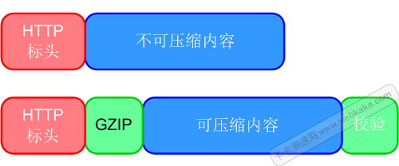
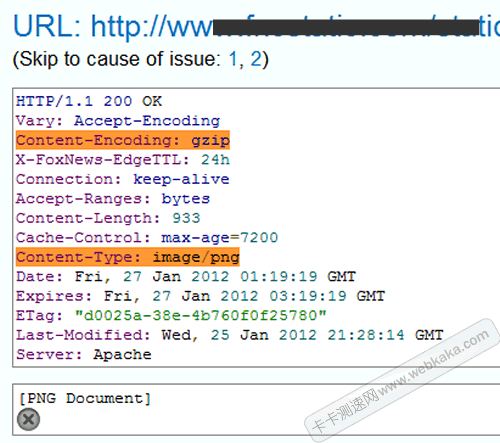

# JPG,PNG,WEBP的区别

JPG图片支持最高级别的压缩，体积小方便储存和传输，但它在生成时就是有损的，会使原始图片数据质量下降。JPG格式可以精确控制压缩比，对图片的色彩信息保留较好，能减少图像的传输时间，适合用于存储图片。
PNG图片支持无损压缩，但其压缩比有上限，这种格式的图片支持无损压缩，能够被编辑，它适合用来做透明图、小图标、背景图等，但占用的存储空间比较大。
Webp是google推出一种图片格式，它的特点就是支持无损或有损压缩，图像体积很小。相同画质下，无损WebP相比PNG减少26%大小，有损Webp在相同的SSIM下比JPE减少25%~34%的大小。对于使用大量图片的网站，Webp图片可以减少流量耗费和加载时间，所以很多网站会使用Webp格式的图片，减少流量耗费和加载时间。

大小比较：PNG > JGP > GIF ≈ webp
透明性：PNG > GIF > JPG
色彩丰富程度：JPG > PNG >GIF
兼容程度：GIF ≈ JPG > PNG

### 图片是否需要启用gzip压缩

> 结论：不要，图片启用GZip压缩会适得其反,不仅浪费了CPU，还增大了体积，势必影响服务器性能，影响网站速度。

一些开发者使用HTTP压缩那些已经本地已经压缩过的文件，而这些已经压缩过的文件再次被GZip压缩时，是不能提高性能的，表现在如下两个方面。

首先，HTTP压缩需要成本。Web服务器获得需要的内容，然后压缩它，最后将它发送到客户端。如果内容不能被进一步压缩，你只是在浪费CPU做无意义的任务。

其次，采用HTTP压缩已经被过压缩的东西并不能使它更小。事实上，添加标头，压缩字典，并校验响应体实际上使它变得更大，如下图所示：

你的网站实际上是这样做的吗？是的，它比你想象的更常见。

PNG图片启用GZip压缩的后果

下面这张是启用GZip压缩的PNG图片，看看它的标头信息：

不仅浪费了CPU，还增大了图片的体积。