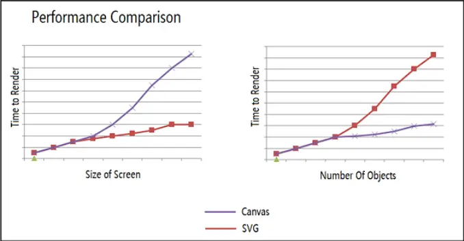

# canvas,svg,webgl的区别

### 什么是svg

- 一种使用XML描述的2D图形的语言
- SVG基于XML意味着，SVG DOM中的每个元素都是可用的，可以为某个元素附加Javascript事件处理器。
- 在 SVG 中，每个被绘制的图形均被视为对象。如果 SVG 对象的属性发生变化，那么浏览器能够自动重现图形。

### 什么是canvas

- 通过Javascript来绘制2D图形。
- 是逐像素进行渲染的。
- 其位置发生改变，会重新进行绘制。

### 什么是webgl

- 说白了就是基于Canvas的3D框架
- 主要用来做 3D 展示、动画、游戏。

### 有了Canvas为什么还要使用SVG

最重要的一点是SVG不依赖于终端设备的像素，可以随意放大缩小但是不会失真

继续：为什么SVG放大不会失真而Canvas却会变模糊呢？

因为SVG的渲染的原理是通过对图形的数学描述来绘图的，例如：以下哆啦A梦的头型的思路是，我先画一个贝塞尔函数，然后填充颜色。

而Canvas的渲染原理是通过对每个像素颜色的填充，最后组成图形。

另外Canvas渲染出来的图叫位图,SVG渲染出来的图叫矢量图

看到这里你肯定会觉得那直接所有图形都用SVG画不就行了，位图就可以直接淘汰了呀，但是SVG画的图也有缺点，以下针对两者的不同做一个对比。

### 两者的对比

||canvas|svg|
|:---:|:-----:|:-----:|
|操作对象|基于像素|基于图形元素|
|元素|单个html元素|多种图形元素|
|驱动|只能脚本驱动|支持脚本和css|
|是否依赖分辨率|是|否|
|保存格式|png jpg|svg|
|适用场景|绘图面积小，数据量大|绘图面积大，数据量小|

### 理解适用场景：

从以下这张微软开发社区公布的性能图中也可以看出，SVG在绘图面积较大，数据量较小的时候性能较好，渲染时间较短，而Canvas刚好相反。

### 总结

Canvas和SVG两者的适用场景不同，开发者在使用是应根据具体的项目需求来选择相应的渲染方式。
