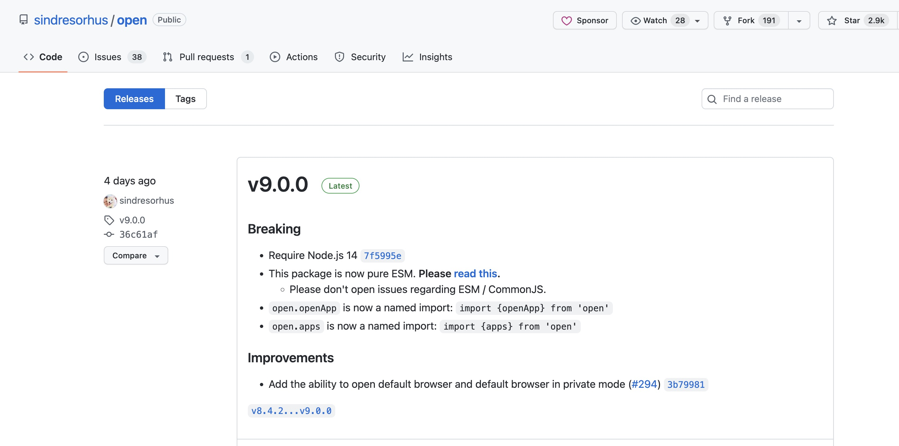

# nrm问题记录

1. 安装nrm后报错需要ES Module

```bash
/Users/{username}/Library/Application Support/fnm/node-versions/v16.19.1/installation/lib/node_modules/nrm/cli.js:9
const open = require('open');
             ^

Error [ERR_REQUIRE_ESM]: require() of ES Module /Users/{username}/Library/Application Support/fnm/node-versions/v16.19.1/installation/lib/node_modules/nrm/node_modules/open/index.js from /Users/{username}/Library/Application Support/fnm/node-versions/v16.19.1/installation/lib/node_modules/nrm/cli.js not supported.
Instead change the require of index.js in /Users/{username}/Library/Application Support/fnm/node-versions/v16.19.1/installation/lib/node_modules/nrm/cli.js to a dynamic import() which is available in all CommonJS modules.
    at Object.<anonymous> (/Users/{username}/Library/Application Support/fnm/node-versions/v16.19.1/installation/lib/node_modules/nrm/cli.js:9:14) {
  code: 'ERR_REQUIRE_ESM'
}
```

> 原因：应该使用 open 的 CommonJs规范的包 ，现在 open v9.0.0 是 ES Module 版本的包



解决方法：npm install -g nrm open@8.4.2 --save

从github的issues复制来的，用于记录

