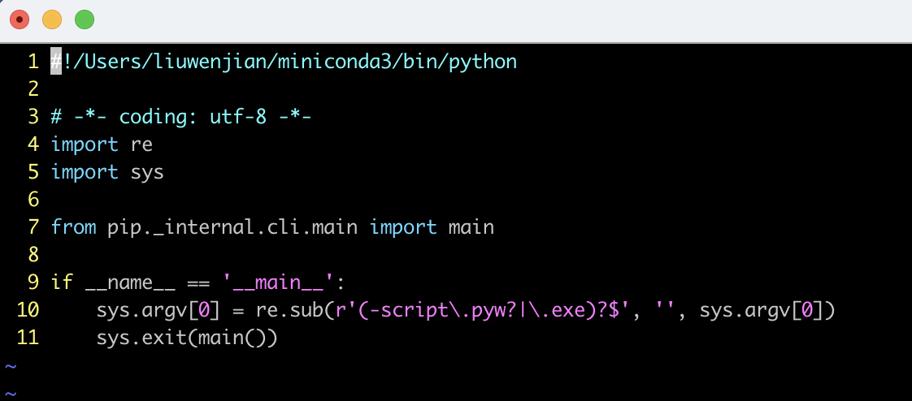

### pip 报错解决

### 问题

使用 pip --version 出现 zsh: /usr/local/bin/pip: bad interpreter: /usr/local/opt/python@2/bin/python2.7: no such file or directory

### 解决方案

```bash
which pip
/usr/local/bin/pip

which python
/Users/<username>/miniconda3/bin/python

vim /usr/local/bin/pip
```

把第一行#!后面的改成/Users/<username>/miniconda3/bin/python 即可


