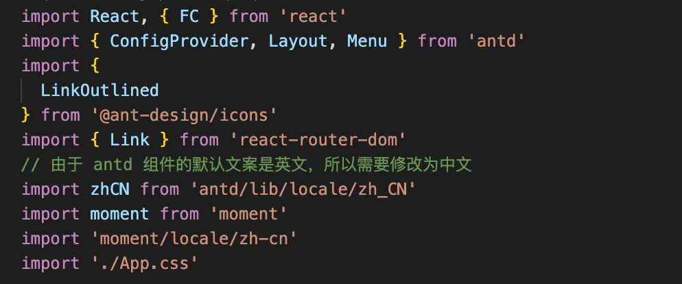

# 基于baseUrl和paths引入模块 

### 背景

在很多Webpack项目中，我们使用了[webpack alias](https://webpack.js.org/configuration/resolve/#resolvealias)，从而支持基于alias进行import：


然而，webpack alias使用过程中往往会遇到问题：

import路径无法进行检查和自动补全（js通过eslint插件可以进行检查，但是依旧无法补全）
无法通过「cmd+点击」进行快速跳转
。。。
怎样解决这些问题？正确的配置姿势应该是怎么样的？本文就来讲讲如何正确的配置项目支持短路径引入模块。

### 统一维护相对路径

首先，需要有一个地方统一维护相对路径的配置，分散到多个地方将不利于维护。

常用的与模块路径相关的配置主要有：

- webpack配置：主要是配置alias，webpack构建时使用
- eslint配置：主要配置import/resolver，对js的路径进行检查。如果是纯ts项目，可以不配置。
- ts配置：[tsconfig.json](https://www.tslang.cn/docs/handbook/tsconfig-json.html)中通过baseUrl和paths指定，主要用于ts编译，VSCode编辑器也会据此对路径进行检查和补全

最合适做法是将相对路径维护在[tsconfig.json](https://www.tslang.cn/docs/handbook/tsconfig-json.html)的baseUrl和paths中，后续其他配置都读取tsconfig。

> 关于tsconfig.json的paths属性

需要注意，paths只影响tsc编译，但不会对输出内容进行修改。也就是说，ts-loader(或babel-loader)输出的js文件还会是基于相对路径引入的。如果webpack不配置对应的alias，后续构建将会出错。

### 打通配置

各项配置之间是无关联的的，所以会出现配置了webpack alias后无法补全和跳转的情况。我们需要让webpack和eslint读取tsconfig中的配置。

### tsconfig.json

首先得有个[tsconfig.json](https://www.tslang.cn/docs/handbook/tsconfig-json.html)。例如：

```js
{
  "compilerOptions": {
      "baseUrl": "./src",
      // paths基于baseUrl
      "paths": {
        "@/*": ["./*"],
        "mansion/*": ["./pages/mansion/*"],
        "something/*": ["./pages/something/*"],
      },
      // ...other configs
  }
}
```

这样的配置使得VSCode和tsc能够将'mansion/some/path'解析到'./src/pages/mansion/some/path'(基于tsconfig.json所处位置)，从而进行编译、编辑器路径提示和补全。

值得一提的是，如果tsconfig中allowJS为true，VSCode也会对js代码中的相对路径进行解析，从而实现检查补全和跳转。

### webpack配置

此时webpack还不知道tsconfig的配置，无法据此对相对路径的资源进行引入，打包将会出错。我们可以安装[tsconfig-paths-webpack-plugin](https://www.npmjs.com/package/tsconfig-paths-webpack-plugin)插件，来将tsconfig中的paths配置同步到webpack中。

安装依赖后，在webpack配置的[resolve.plugins](https://webpack.js.org/configuration/resolve/#resolveplugins)（注意不是plugin）中添加插件：

```js
// webpack/get-webpack-config.js
config.webpackConfig.resolve.plugins.push(
  new TsconfigPathsPlugin({
    configFile: path.join(workspace, 'tsconfig.json')
  })
);
```

这样一来，webpack就能支持tsconfg中配置的相对路径，效果和配置webpack的alias一样。

### eslint配置

目前还有很多项目是ts和js混合的。在这样的项目中，如果设置了tsconfig的allowJs，编辑器将能够正确解析js文件中用到的相对路径，但是eslint会有抛出一堆烦人的错误（’’import/unresolved’）。一种粗放的做法是将相应规则调成warning甚至关掉，但是显然不是我们想要的。

想要让eslint识别tsconfig中的paths，可以使用[eslint-import-resolver-typescript](https://www.npmjs.com/package/eslint-import-resolver-typescript)插件。这个插件为[eslint-plugin-import](https://www.npmjs.com/package/eslint-plugin-import)增加了ts和tsx文件的支持，更重要的是会读取tsconfig来检查js中的路径。
使用的话很简单，安装后在.eslintrc.js中开启即可。

```js
// .eslintrc.js
module.exports = {
    extends: '@qunhe/eslint-config-qunhefe/react/index',
    settings: {
        'import/resolver': {
            'eslint-import-resolver-typescript': true,
        }
    }
};
```

### 其他情况

##### 使用node或者ts-node执行

如果是一个使用Typescript写的nodejs应用，开发环境往往是直接使用ts-node运行ts代码，而生产环境使用node运行tsc编译后的js代码。

对于ts-node来说，虽然会读取tsconfig来编译代码，但是执行的时候非'.'和'/'开头的模块会在node_modules中进行查找而不是根据tsconfig配置来解析，最终执行报错。

node同理，tsc编译后的代码依旧包含基于baseUrl的相对路径，直接执行将会找不到模块。

此时就需要使用tsconfig-paths来将基于baseUrl的路径解析到实际的文件上：

```js
# with ts-node
ts-node -r tsconfig-paths/register src/main.ts
# with node
node -r ts-node/register/transpile-only -r tsconfig-paths/register dist/main.js
```

> 关于node下使用

tsconfig-paths的文档中写着node下的使用和ts-node一致，然而实际上有bug无法生效，需要额外调用ts-node/register


### 使用babel转换代码(不使用webpack)

- 转换：使用[babel-plugin-module-resolver](https://www.npmjs.com/package/babel-plugin-module-resolver)，不过不支持读取tsconfig，还需要在babelrc中维护一份对应的相对路径的配置用于转换
- lint：可以使用[eslint-import-resolver-typescript](https://www.npmjs.com/package/eslint-import-resolver-typescript)（读取tsconfig），也可以使用[eslint-import-resolver-babel-module](https://www.npmjs.com/package/eslint-import-resolver-babel-module)（读取babelrc）