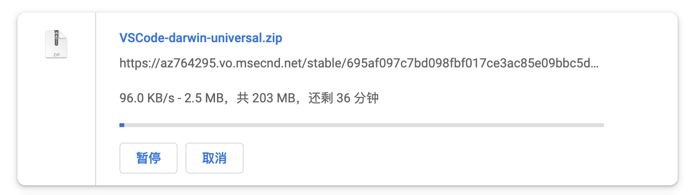

# vscode 下载太慢的问题解决

1. 到[vscode](https://code.visualstudio.com/)官网下载

2. 进入下载管理，复制链接管理

复制链接地址，如[https://az764295.vo.msecnd.net/stable/695af097c7bd098fbf017ce3ac85e09bbc5dda06/VSCode-darwin-universal.zip](https://az764295.vo.msecnd.net/stable/695af097c7bd098fbf017ce3ac85e09bbc5dda06/VSCode-darwin-universal.zip)

3. 替换链接内容

将下载地址中的 az764295.vo.msecnd.net 更换为 vscode.cdn.azure.cn 使用国内的镜像服务器加速
