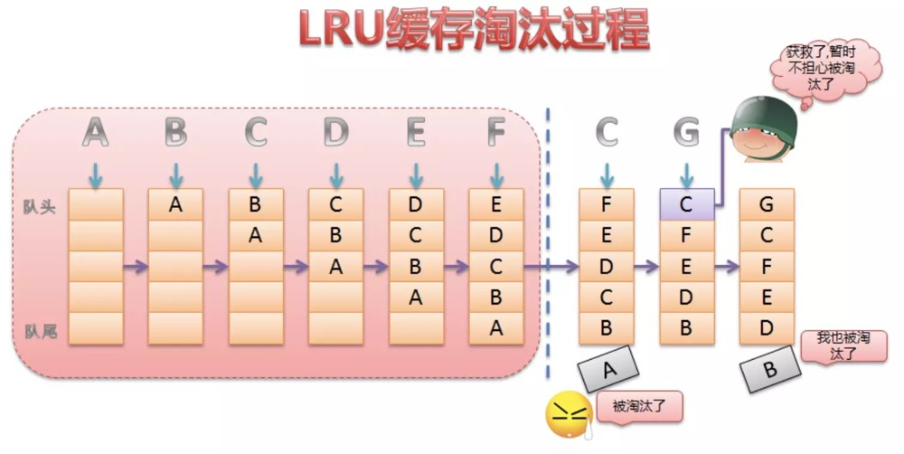

# keep-alive缓存及其缓存优化原理

keep-alive组件接受include，exclude，max三个参数
include 指定需要缓存的组件name集合，参数格式支持String, RegExp, Array。当为字符串的时候，多个组件名称以逗号隔开。
exclude 指定不需要缓存的组件name集合，参数格式和include一样。
max 指定最多可缓存组件的数量,超过数量删除第一个。参数格式支持String、Number。

keep-alive使用LRU，最近最少使用策略
命中缓存,直接从缓存拿vnode 的组件实例,并且重新调整了 key 的顺序放在了数组最后一个，不命中缓存,把 vnode 设置进缓存，如果配置了 max 并且缓存的长度超过了 this.max，删除数组第一个元素。

LRU （least-recently-used）- 最近最少使用策略：
以时间作为参考，如果数据最近被访问过，那么将来被访问的几率会更高，如果以一个数组去记录数据，当有一数据被访问时，该数据会被移动到数组的末尾，表明最近被使用过，当缓存溢出时，会删除数组的头部数据，即将最不频繁使用的数据移除。（keep-alive 的优化处理）。




```js
export default {

    name: "keep-alive",

    abstract: true, // 抽象组件属性 ,它在组件实例建立父子关系的时候会被忽略,发生在 initLifecycle 的过程中

    props: {

        include: patternTypes, // 被缓存组件

        exclude: patternTypes, // 不被缓存组件

        max: [String, Number] // 指定缓存大小

    },


    created() {

        this.cache = Object.create(null); // 缓存

        this.keys = []; // 缓存的VNode的键

    },


    destroyed() {

        for (const key in this.cache) {

            // 删除所有缓存

            pruneCacheEntry(this.cache, key, this.keys);

        }

    },


    mounted() {

        // 监听缓存/不缓存组件

        this.$watch("include", val => {

            pruneCache(this, name => matches(val, name));

        });

        this.$watch("exclude", val => {

            pruneCache(this, name => !matches(val, name));

        });

    },


    render() {

        // 获取第一个子元素的 vnode

        const slot = this.$slots.default;

        const vnode: VNode = getFirstComponentChild(slot);

        const componentOptions: ? VNodeComponentOptions =

            vnode && vnode.componentOptions;

        if (componentOptions) {

            // name不在inlcude中或者在exlude中 直接返回vnode

            // check pattern

            const name: ? string = getComponentName(componentOptions);

            const {
                include,
                exclude
            } = this;

            if (

                // not included

                (include && (!name || !matches(include, name))) ||

                // excluded

                (exclude && name && matches(exclude, name))

            ) {

                return vnode;

            }


            const {
                cache,
                keys
            } = this;

            // 获取键，优先获取组件的name字段，否则是组件的tag

            const key: ? string =

                vnode.key == null

                ? // same constructor may get registered as different local components

                // so cid alone is not enough (#3269)

                componentOptions.Ctor.cid +

                (componentOptions.tag ? `::${componentOptions.tag}` : "")

                :
                vnode.key;

            // 命中缓存,直接从缓存拿vnode 的组件实例,并且重新调整了 key 的顺序放在了最后一个

            if (cache[key]) {

                vnode.componentInstance = cache[key].componentInstance;

                // make current key freshest

                remove(keys, key);

                keys.push(key);

            }

            // 不命中缓存,把 vnode 设置进缓存
            else {

                cache[key] = vnode;

                keys.push(key);

                // prune oldest entry

                // 如果配置了 max 并且缓存的长度超过了 this.max，还要从缓存中删除第一个

                if (this.max && keys.length > parseInt(this.max)) {

                    pruneCacheEntry(cache, keys[0], keys, this._vnode);

                }

            }

            // keepAlive标记位

            vnode.data.keepAlive = true;

        }

        return vnode || (slot && slot[0]);

    }

}
```
