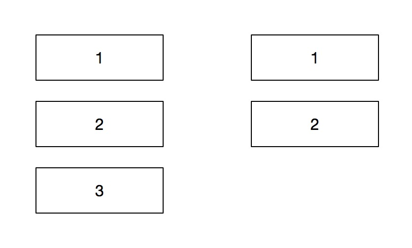

# Vue2.0的v-for中的key的作用

key的作用主要是虚拟dom在进行diff算法的时候，用来做唯一值比较的。

key 是 Vue 中 vnode 的唯一标记，通过这个 key，我们的 diff 操作可以更准确、更快速。

若不存在key，diff算法可能需要比较的次数大增。

同时不能使用index做为key，当key为index时，容易出现误删。

假如列表有三项元素，使用index作为key，如下图。



删除第二项的时候，最终结果会变成什么呢，是1、2。

由于key中0、1依然存在，所以vue会认为第三项被删除了，因此必须使用id作为key。

假如后端没有给id，可以自己生成id或者uuid。


```html
<!DOCTYPE html>
<html lang="en">
<head>
    <meta charset="UTF-8">
    <meta http-equiv="X-UA-Compatible" content="IE=edge">
    <meta name="viewport" content="width=device-width, initial-scale=1.0">
    <title>Vue删除异常问题</title>
    <style>
        .item {
            list-style: none;
            display: flex;
            flex: 1;
        }

        .item:nth-child(n+2) {
            margin-top: 10px;
        }

        .btn {
            margin-left: 20px;
        }
    </style>
</head>
<body>
    <div id="app">
        <ul>
            <li class="item" v-for="(item, index) in arr" :key="index">
                <aa :name="jajah"></aa>
                <button class="btn" @click="del(index)">删除</button>
            </li>
        </ul>
    </div>
    <script src="https://cdn.jsdelivr.net/npm/vue/dist/vue.js"></script>
    <script>
        Vue.component('aa', {
            props: {
                name: String
            },
            template: '<div><span>{{name}}</span><span>{{Math.floor(Math.random()*1000)}}</span></div>'
        })
        new Vue({
            el: '#app',
            data: {
                arr: [1, 2, 3, 4]
            },
            methods: {
                del (i) {
                    this.arr.splice(i, 1)
                }
            }
        })
    </script>
</body>
</html>
```